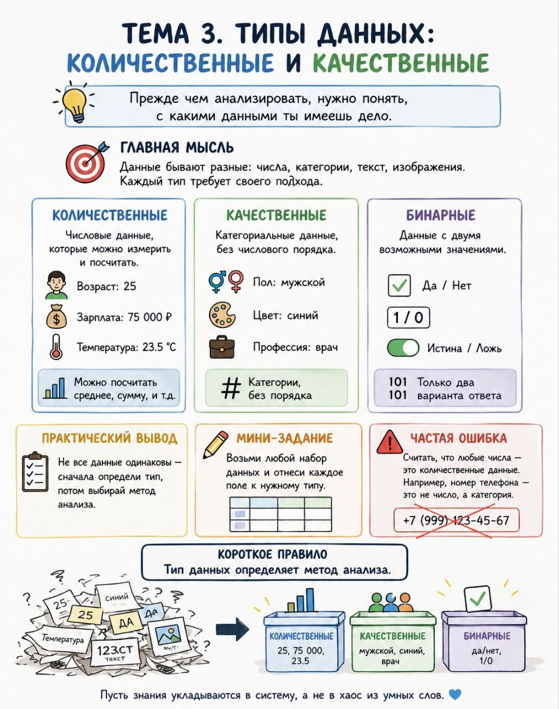

# Тема 3. Типы данных: количественные и качественные

**Номер:** 3

Тема 3. Типы данных: количественные и качественные

Прежде чем анализировать, нужно понять, с какими данными ты имеешь дело.

Главная мысль
Данные бывают разные: числа, категории, текст, изображения. Каждый тип требует своего подхода.

Примеры

• Количественные: возраст, зарплата, температура (можно посчитать среднее)
• Качественные: пол, цвет, профессия (категории без порядка)
• Бинарные: да/нет, 1/0

Практический вывод
Не все данные одинаковы — сначала определи тип, потом выбирай метод анализа.

Мини-задание
Возьми любой набор данных и отнеси каждое поле к нужному типу.

Частая ошибка
Считать, что любые числа — это количественные данные. Например, номер телефона — это не число, а категория.

Короткое правило
Тип данных определяет метод анализа.

Пусть знания укладываются в систему, а не в хаос из умных слов.
