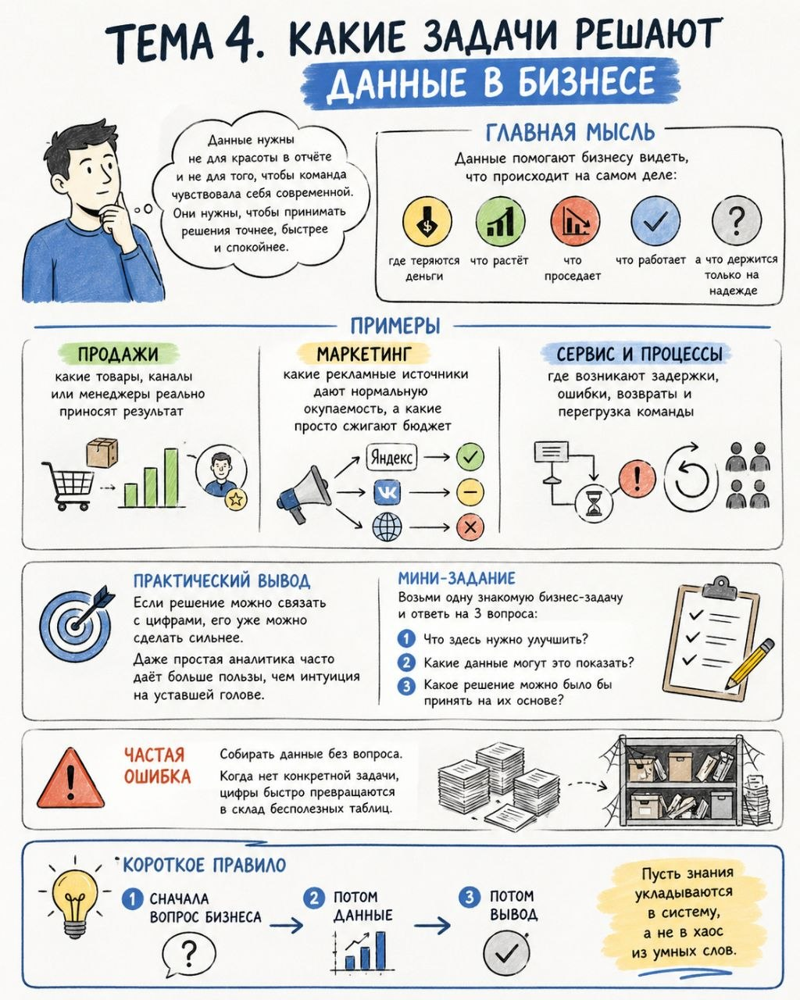

# Тема 4. Какие задачи решают данные в бизнесе

**Номер:** 4

Тема 4. Какие задачи решают данные в бизнесе

Данные нужны не для красоты в отчёте и не для того, чтобы команда чувствовала себя современной. Они нужны, чтобы принимать решения точнее, быстрее и спокойнее.

Главная мысль
Данные помогают бизнесу видеть, что происходит на самом деле: где теряются деньги, что растёт, что проседает, что работает, а что держится только на надежде.

Примеры

• продажи: какие товары, каналы или менеджеры реально приносят результат
• маркетинг: какие рекламные источники дают нормальную окупаемость, а какие просто сжигают бюджет
• сервис и процессы: где возникают задержки, ошибки, возвраты и перегрузка команды

Практический вывод
Если решение можно связать с цифрами, его уже можно сделать сильнее. Даже простая аналитика часто даёт больше пользы, чем интуиция на уставшей голове.

Мини-задание
Возьми одну знакомую бизнес-задачу и ответь на 3 вопроса:

1. Что здесь нужно улучшить?
2. Какие данные могут это показать?
3. Какое решение можно было бы принять на их основе?

Частая ошибка
Собирать данные без вопроса. Когда нет конкретной задачи, цифры быстро превращаются в склад бесполезных таблиц.

Короткое правило
Сначала вопрос бизнеса, потом данные, потом вывод.

Пусть знания укладываются в систему, а не в хаос из умных слов.
