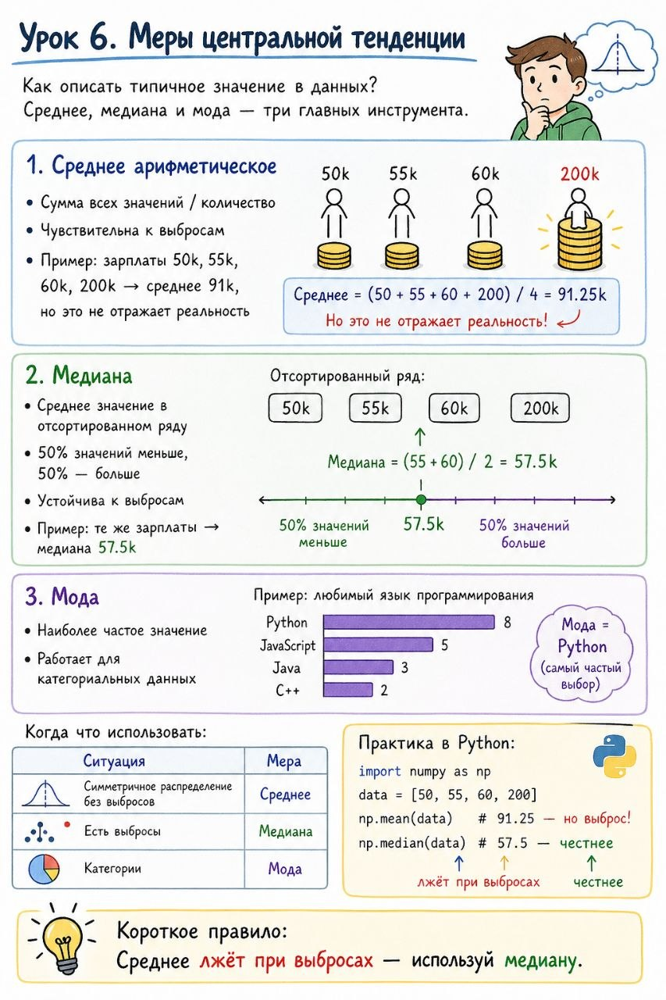

# Урок 6. Меры центральной тенденции

**Номер:** 6

Урок 6. Меры центральной тенденции

Как описать типичное значение в данных? Среднее, медиана и мода — три главных инструмента.

Среднее арифметическое:

• Сумма всех значений / количество
• Чувствительна к выбросам
• Пример: зарплаты 50k, 55k, 60k, 200k → среднее 91k, но это не отражает реальность

Медиана:

• Среднее значение в отсортированном ряду
• 50% значений меньше, 50% — больше
• Устойчива к выбросам
• Пример: те же зарплаты → медиана 57.5k

Мода:

• Наиболее частое значение
• Работает для категориальных данных

Когда что использовать:

| Ситуация                                | Мера    |
| --------------------------------------- | ------- |
| Симметричное распределение без выбросов | Среднее |
| Есть выбросы                            | Медиана |
| Категории                               | Мода    |
Практика в Python:

import numpy as np
data = [50, 55, 60, 200]
np.mean(data)    # 91.25 — но выброс!
np.median(data) # 57.5 — честнее
Короткое правило:
Среднее лжёт при выбросах — используй медиану.
