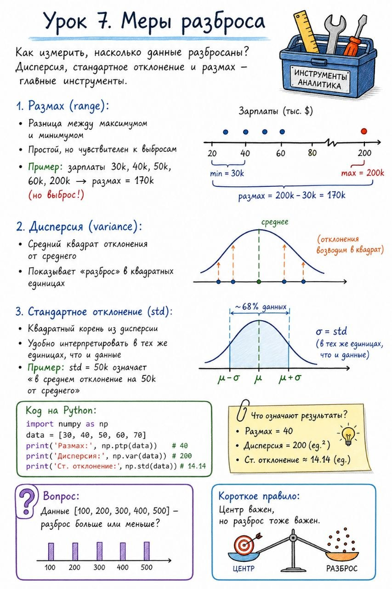

# Урок 7. Меры разброса

**Номер:** 7

Урок 7. Меры разброса

Как измерить, насколько данные разбросаны? Дисперсия, стандартное отклонение и размах — главные инструменты.

Размах (range):

• Разница между максимумом и минимумом
• Простой, но чувствителен к выбросам
• Пример: зарплаты 30k, 40k, 50k, 60k, 200k → размах = 170k (но выброс!)

Дисперсия (variance):

• Средний квадрат отклонения от среднего
• Показывает «разброс» в квадратных единицах

Стандартное отклонение (std):

• Квадратный корень из дисперсии
• Удобно интерпретировать в тех же единицах, что и данные
• Пример: std = 50k означает «в среднем отклонение на 50k от среднего»

Код на Python:
data = [30, 40, 50, 60, 70]
print('Размах:', np.ptp(data))  # 40
print('Дисперсия:', np.var(data))  # 200
print('Ст. отклонение:', np.std(data))  # 14.14

Вопрос:
Данные [100, 200, 300, 400, 500] — разброс больше или меньше?

Короткое правило:
Центр важен, но разброс тоже важен.
