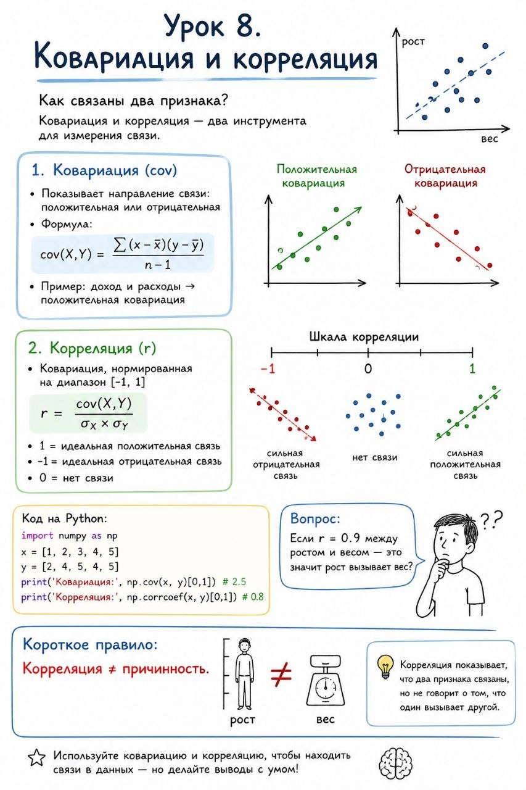

# Урок 8. Ковариация и корреляция

**Номер:** 8

Урок 8. Ковариация и корреляция

Как связаны два признака? Ковариация и корреляция — два инструмента для измерения связи.

Ковариация (cov):

• Показывает направление связи: положительная или отрицательная
• Формула: cov(X,Y) = Σ(x-x‌)(y-ȳ) / (n-1)
• Пример: доход и расходы → положительная ковариация

Корреляция (r):

• Ковариация, нормированная на диапазон [-1, 1]
• r = cov(X,Y) / (σX × σY)
• 1 = идеальная положительная связь
• -1 = идеальная отрицательная связь
• 0 = нет связи

Код на Python:
import numpy as np
x = [1, 2, 3, 4, 5]
y = [2, 4, 5, 4, 5]
print('Ковариация:', np.cov(x, y)[0,1])  # 2.5
print('Корреляция:', np.corrcoef(x, y)[0,1])  # 0.8

Вопрос:
Если r = 0.9 между ростом и весом — это значит рост вызывает вес?

Короткое правило:
Корреляция ≠ причинность.
