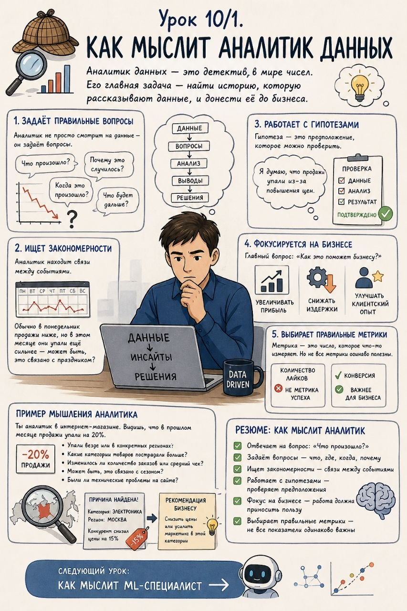

# Урок 10/1. Как мыслит аналитик данных

**Номер:** 10/1

Урок 10/1. Как мыслит аналитик данных

Аналитик данных — это детектив в мире чисел. Его главная задача — найти историю, которую рассказывают данные, и донести её до бизнеса.

───

Что аналитик делает каждый день

1. Задаёт правильные вопросы

Аналитик не просто смотрит на данные — он задаёт вопросы. Что произошло? Когда это произошло? Почему это случилось? Что будет дальше?

Пример: видишь, что продажи упали. Но это только начало. Вопросы:

• «Насколько упали?»
• «В каких регионах?»
• «Какие товары?»
• «В какое время?»
• «По сравнению с чем?»

───

2. Ищет закономерности

Аналитик находит связи между событиями.

Пример: «Обычно в понедельник продажи ниже, но в этом месяце они упали ещё сильнее — может быть, это связано с праздником?»

───

3. Работает с гипотезами

Гипотеза — это предположение, которое можно проверить.

Пример: «Я думаю, что продажи упали из-за повышения цен». Проверяешь данные — и либо подтверждаешь, либо опровергаешь.

───

4. Фокусируется на бизнесе

Главный вопрос: «Как это поможет бизнесу?»

Аналитик всегда помнит, что его работа должна приносить пользу компании:

• Увеличивать прибыль
• Снижать издержки
• Улучшать клиентский опыт

───

5. Выбирает правильные метрики

Метрика — это число, которое что-то измеряет. Но не все метрики одинаково полезны.

Пример: «количество лайков» — не метрика успеха. «Конверсия» — гораздо важнее для бизнеса.

───

Пример мышления аналитика

Представь, что ты аналитик в интернет-магазине. Ты видишь, что в прошлом месяце продажи упали на 20%.

Ты начинаешь задавать вопросы:

• Упали везде или в конкретных регионах?
• Какие категории товаров пострадали больше?
• Изменилось ли количество заказов или средний чек?
• Может быть, это связано с сезоном?
• Были ли технические проблемы на сайте?

Ты копаешься в данных и находишь: основная проблема — в категории «электроника», причём именно в Москве. Оказывается, конкурент снизил цены на 15%. Вот она — причина!

Теперь ты можешь дать рекомендацию бизнесу: либо снизить цены, либо усилить маркетинг в этой категории.
───

Резюме: как мыслит аналитик

• Отвечает на вопрос: «Что произошло?»
• Задаёт вопросы — что, где, когда, почему
• Ищет закономерности — связи между событиями
• Работает с гипотезами — проверяет предположения
• Фокус на бизнесе — работа должна приносить пользу
• Выбирает правильные метрики — не все показатели одинаково важны

───

Следующий урок: Как мыслит ML-специалист →
