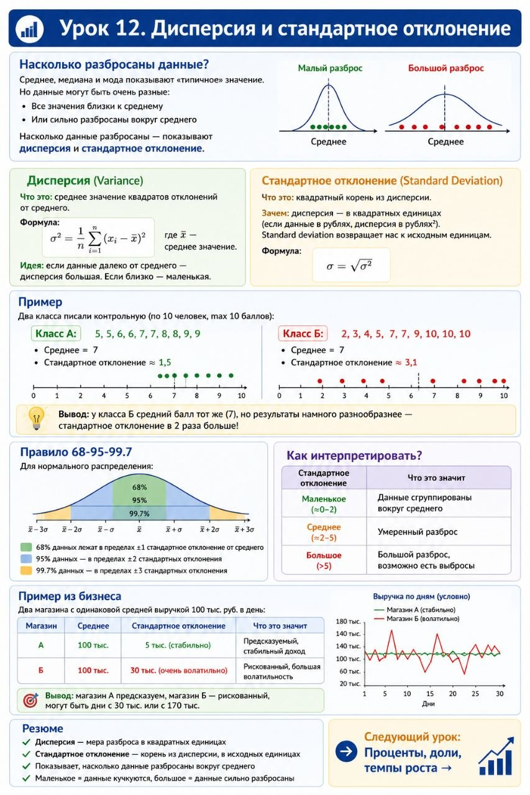

# Урок 12. Дисперсия и стандартное отклонение

**Номер:** 12

Урок 12. Дисперсия и стандартное отклонение

Насколько разбросаны данные?

Среднее, медиана и мода показывают «типичное» значение. Но данные могут быть очень разные:

• Все значения близки к среднему
• Или сильно разбросаны вокруг среднего

Насколько данные разбросаны — показывают дисперсия и стандартное отклонение.

───

Дисперсия (Variance)

Что это: среднее значение квадратов отклонений от среднего.

Формула:

где x‌ — среднее значение.

Идея: если данные далеко от среднего — дисперсия большая. Если близко — маленькая.

───

Стандартное отклонение (Standard Deviation)

Что это: квадратный корень из дисперсии.

Зачем: дисперсия — в квадратных единицах (если данные в рублях, дисперсия в рублях²). Standard deviation возвращает нас к исходным единицам.

Формула:

───

Пример

Два класса писали контрольную (по 10 человек, max 10 баллов):

Класс А: 5, 5, 6, 6, 7, 7, 8, 8, 9, 9

• Среднее = 7
• Стандартное отклонение ≈ 1,5

Класс Б: 2, 3, 4, 5, 7, 7, 9, 10, 10, 10

• Среднее = 7
• Стандартное отклонение ≈ 3,1

Вывод: у класса Б средний балл тот же (7), но результаты намного разнообразнее — стандартное отклонение в 2 раза больше!

───

Правило 68-95-99.7

Для нормального распределения:

• 68% данных лежат в пределах ±1 стандартное отклонение от среднего
• 95% данных — в пределах ±2 стандартных отклонения
• 99.7% данных — в пределах ±3 стандартных отклонения

───

Как интерпретировать?

| Стандартное отклонение | Что это значит                         |
| ---------------------- | -------------------------------------- |
| Маленькое (≈0-2)       | Данные сгруппированы вокруг среднего   |
| Среднее (≈2-5)         | Умеренный разброс                      |
| Большое (>5)           | Большой разброс, возможно есть выбросы |
───

Пример из бизнеса

Два магазина с одинаковой средней выручкой 100 тыс. руб. в день:

| Магазин | Среднее  | Стандартное отклонение     |
| ------- | -------- | -------------------------- |
| А       | 100 тыс. | 5 тыс. (стабильно)         |
| Б       | 100 тыс. | 30 тыс. (очень волатильно) |
Вывод: магазин А предсказуем, магазин Б — рискованный, могут быть дни с 30 тыс. или с 170 тыс.

───

Резюме

• Дисперсия — мера разброса в квадратных единицах
• Стандартное отклонение — корень из дисперсии, в исходных единицах
• Показывает, насколько данные разбросаны вокруг среднего
• Маленькое = данные кучкуются, большое = данные сильно разбросаны

───

Следующий урок: Проценты, доли, темпы роста →
