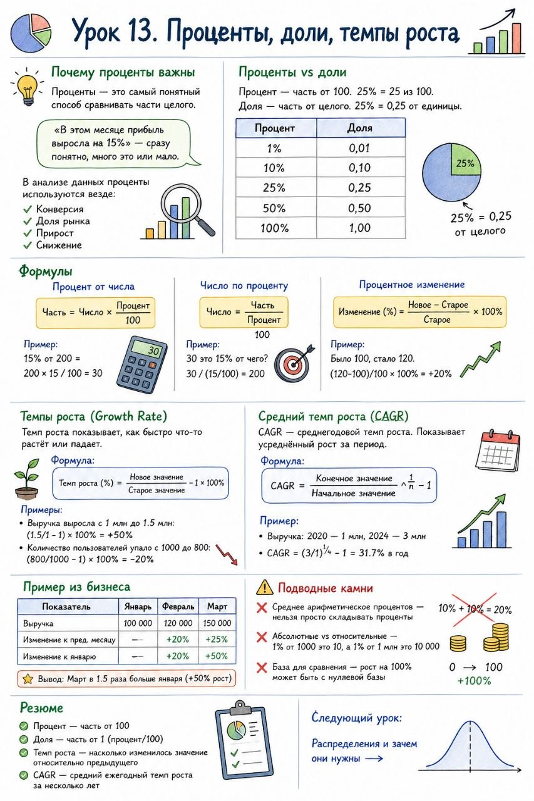

# Урок 13. Проценты, доли, темпы роста

**Номер:** 13

Урок 13. Проценты, доли, темпы роста

Почему проценты важны

Проценты — это самый понятный способ сравнивать части целого.

«В этом месяце прибыль выросла на 15%» — сразу понятно, много это или мало.

В анализе данных проценты используются везде:

• Конверсия
• Доля рынка
• Прирост
• Снижение

───

Проценты vs доли

Процент — часть от 100. 25% = 25 из 100.

Доля — часть от целого. 25% = 0,25 от единицы.

| Процент | Доля |
| ------- | ---- |
| 1%      | 0,01 |
| 10%     | 0,10 |
| 25%     | 0,25 |
| 50%     | 0,50 |
| 100%    | 1,00 |
───

Формулы

Процент от числа

Пример: 15% от 200 = 200 × 15 / 100 = 30

Число по проценту

Пример: 30 это 15% от чего? 30 / (15/100) = 200

Процентное изменение

Пример: Было 100, стало 120.
Изменение = (120-100)/100 × 100% = +20%

───

Темпы роста (Growth Rate)

Темп роста показывает, как быстро что-то растёт или падает.

Формула:

Примеры:

• Выручка выросла с 1 млн до 1.5 млн: (1.5/1 - 1) × 100% = +50%
• Количество пользователей упало с 1000 до 800: (800/1000 - 1) × 100% = -20%

───

Средний темп роста (CAGR)

CAGR — среднегодовой темп роста. Показывает усреднённый рост за период.

Формула:

Пример:

• Выручка: 2020 — 1 млн, 2024 — 3 млн
• CAGR = (3/1)^(1/4) - 1 = 31.7% в год

───

Пример из бизнеса

| Показатель               | Январь  | Февраль | Март    |
| ------------------------ | ------- | ------- | ------- |
| Выручка                  | 100 000 | 120 000 | 150 000 |
| Изменение к пред. месяцу | —       | +20%    | +25%    |
| Изменение к январю       | —       | +20%    | +50%    |
Вывод: Март в 1.5 раза больше января (+50% рост)

───

Подводные камни

❌ Среднее арифметическое процентов — нельзя просто складывать проценты

❌ Абсолютные vs относительные — 1% от 1000 это 10, а 1% от 1 млн это 10 000

❌ База для сравнения — рост на 100% может быть с нулевой базы

───

Резюме

• Процент — часть от 100
• Доля — часть от 1 (процент/100)
• Темп роста — насколько изменилось значение относительно предыдущего
• CAGR — средний ежегодный темп роста за несколько лет

───

Следующий урок: Распределения и зачем они нужны →
