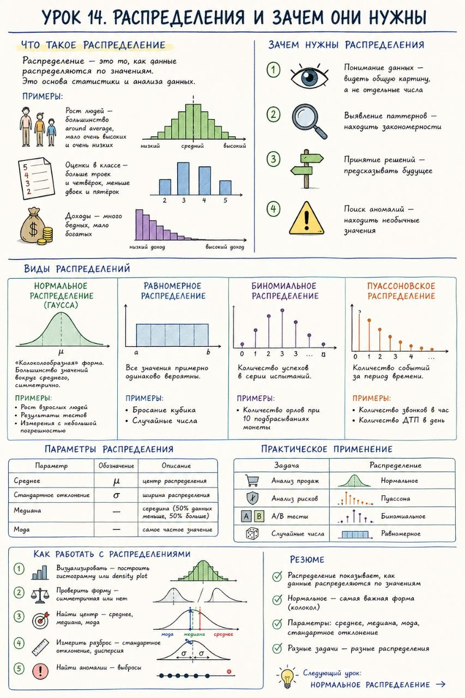

# Урок 14. Распределения и зачем они нужны

**Номер:** 14

Урок 14. Распределения и зачем они нужны

Что такое распределение

Распределение — это то, как данные распределяются по значениям. Это основа статистики и анализа данных.

Примеры:

• Рост людей — большинство around average, мало очень высоких и очень низких
• Оценки в классе — больше троек и четвёрок, меньше двоек и пятёрок
• Доходы — много бедных, мало богатых

───

Зачем нужны распределения

1. Понимание данных — видеть общую картину, а не отдельные числа
2. Выявление паттернов — находить закономерности
3. Принятие решений — предсказывать будущее
4. Поиск аномалий — находить необычные значения

───

Виды распределений

Нормальное распределение (Гаусса)

«Колоколообразная» форма. Большинство значений вокруг среднего, симметрично.

Примеры:

• Рост взрослых людей
• Результаты тестов
• Измерения с небольшой погрешностью

Равномерное распределение

Все значения примерно одинаково вероятны.

Примеры:

• Бросание кубика
• Случайные числа

Биномиальное распределение

Количество успехов в серии испытаний.

Примеры:

• Количество орлов при 10 подбрасываниях монеты

Пуассоновское распределение

Количество событий за период времени.

Примеры:

• Количество звонков в час
• Количество ДТП в день

───

Параметры распределения

| Параметр               | Обозначение | Описание                                 |
| ---------------------- | ----------- | ---------------------------------------- |
| Среднее                | μ           | центр распределения                      |
| Стандартное отклонение | σ           | ширина распределения                     |
| Медиана                | —           | середина (50% данных меньше, 50% больше) |
| Мода                   | —           | самое частое значение                    |
───

Практическое применение

| Задача          | Распределение |
| --------------- | ------------- |
| Анализ продаж   | Нормальное    |
| Анализ рисков   | Пуассона      |
| A/B тесты       | Биномиальное  |
| Случайные числа | Равномерное   |
───

Как работать с распределениями

1. Визуализировать — построить гистограмму или density plot
2. Проверить форму — симметричная или нет
3. Найти центр — среднее, медиана, мода
4. Измерить разброс — стандартное отклонение, дисперсия
5. Найти аномалии — выбросы

───

Резюме

• Распределение показывает, как данные распределяются по значениям
• Нормальное — самая важная форма (колокол)
• Параметры: среднее, медиана, мода, стандартное отклонение
• Разные задачи — разные распределения

───

Следующий урок: Нормальное распределение →
