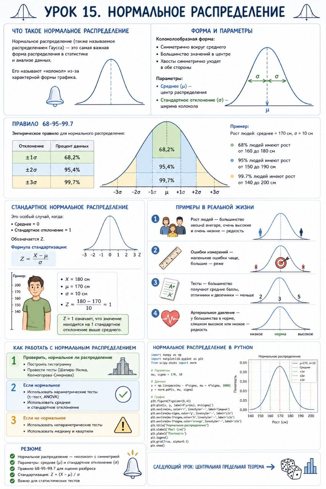

# Урок 15. Нормальное распределение

**Номер:** 15

Урок 15. Нормальное распределение

Что такое нормальное распределение

Нормальное распределение (также называемое распределением Гаусса) — это самая важная форма распределения в статистике и анализе данных.

Его называют «колокол» из-за характерной формы графика.

───

Форма и параметры

Колоколообразная форма:

• Симметрично вокруг среднего
• Большинство значений в центре
• Хвосты симметрично уходят в обе стороны

Параметры:

• Среднее (μ) — центр распределения
• Стандартное отклонение (σ) — ширина колокола

───

Правило 68-95-99.7

Эмпирическое правило для нормального распределения:

| Отклонение | Процент данных |
| ---------- | -------------- |
| ±1σ        | 68,2%          |
| ±2σ        | 95,4%          |
| ±3σ        | 99,7%          |
Пример:

• Рост людей: среднее = 170 см, σ = 10 см
• 68% людей имеют рост от 160 до 180 см
• 95% людей имеют рост от 150 до 190 см
• 99.7% людей имеют рост от 140 до 200 см

───

Стандартное нормальное распределение

Это особый случай, когда:

• Среднее = 0
• Стандартное отклонение = 1

Обозначается Z.

Формула стандартизации:

Пример:

• X = 180 см
• μ = 170 см
• σ = 10 см
• Z = (180 - 170) / 10 = 1

Z = 1 означает, что значение находится на 1 стандартное отклонение выше среднего.

───

Примеры в реальной жизни

1. Рост людей — большинство around average, очень высокие и очень низкие — редкость
2. Ошибки измерений — маленькие ошибки чаще, большие — реже
3. Тесты — большинство получают средние баллы, отличники и двоечники — меньше
4. Артериальное давление — у большинства в норме, слишком высокое или низкое — редкость

───

Как работать с нормальным распределением

1. Проверить, нормальное ли распределение
  • Построить гистограмму
  • Провести тесты (Шапиро-Уилка, Колмогорова-Смирнова)
2. Если нормальное
  • Использовать параметрические тесты (t-тест, ANOVA)
  • Использовать среднее и стандартное отклонение
3. Если не нормальное
  • Использовать непараметрические тесты
  • Использовать медиану и квартили

Резюме

• Нормальное распределение — «колокол» с симметрией
• Параметры: среднее (μ) и стандартное отклонение (σ)
• Правило 68-95-99.7 для оценки разброса
• Стандартизация: Z = (X - μ) / σ
• Важно для статистических тестов

───

Следующий урок: Центральная предельная теорема →
