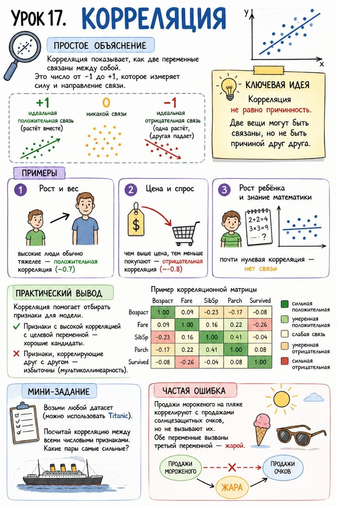

# Урок 17. Корреляция

**Номер:** 17

Урок 17. Корреляция

Простое объяснение
Корреляция показывает, как две переменные связаны между собой. Это число от -1 до +1, которое измеряет силу и направление связи.

+1 — идеальная положительная связь (растёт вместе)
-1 — идеальная отрицательная связь (одна растёт, другая падает)
0 — никакой связи

Ключевая идея
Корреляция не равно причинность. Две вещи могут быть связаны, но не быть причиной друг друга.

Примеры

1. Рост и вес: высокие люди обычно тяжелее — положительная корреляция (~0.7)
2. Цена и спрос: чем выше цена, тем меньше покупают — отрицательная корреляция (~-0.8)
3. Рост ребёнка и знание математики: почти нулевая корреляция — нет связи

Практический вывод
Корреляция помогает отбирать признаки для модели. Признаки с высокой корреляцией с целевой переменной — хорошие кандидаты. Признаки, коррелирующие друг с другом — избыточны (мультиколлинеарность).

Мини-задание
Возьми любой датасет (можно использовать Titanic). Посчитай корреляцию между всеми числовыми признаками. Какие пары самые сильные?

Частая ошибка
Продажи мороженого на пляже коррелируют с продажами солнцезащитных очков, но не вызывают их. Обе переменные вызваны третьей переменной — жарой.
