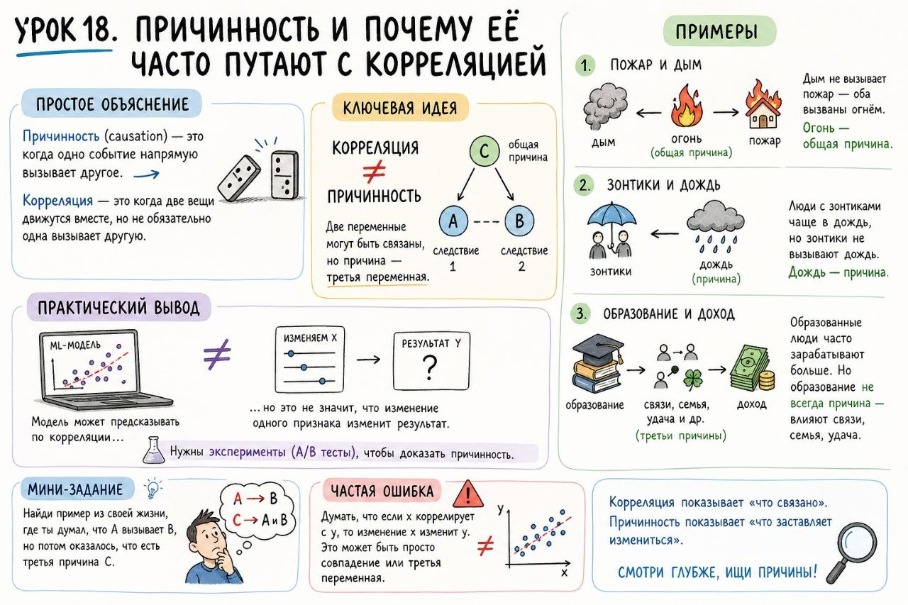

# Урок 18. Причинность и почему её часто путают с корреляцией

**Номер:** 18

Урок 18. Причинность и почему её часто путают с корреляцией

Простое объяснение
Причинность (causation) — это когда одно событие напрямую вызывает другое. Корреляция — это когда две вещи движутся вместе, но не обязательно одна вызывает другую.

Ключевая идея
Корреляция ≠ причинность. Две переменные могут быть связаны, но причина — третья переменная.

Примеры

1. Пожар и дым: дым не вызывает пожар — оба вызваны огнём. Огонь — общая причина.
2. Зонтики и дождь: люди с зонтиками чаще в дождь, но зонтики не вызывают дождь. Дождь — причина.
3. Образование и доход: образованные люди часто зарабатывают больше. Но образование не всегда причина — влияют связи, семья, удача.

Практический вывод
Для ML-моделей важно понимать: модель может предсказывать по корреляции, но это не значит, что изменение одного признака изменит результат. Нужны эксперименты (A/B тесты), чтобы доказать причинность.

Мини-задание
Найди пример из своей жизни, где ты думал, что A вызывает B, но потом оказалось, что есть третья причина C.

Частая ошибка
Думать, что если x коррелирует с y, то изменение x изменит y. Это может быть просто совпадение или третья переменная.
