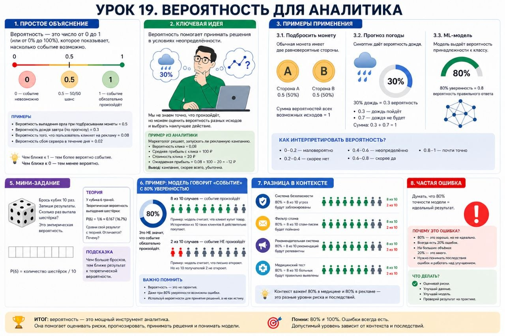

# Урок 19. Вероятность для аналитика

**Номер:** 19

Урок 19. Вероятность для аналитика

Простое объяснение
Вероятность — это число от 0 до 1 (или 0% до 100%), которое показывает, насколько событие возможно.

0 — событие невозможно
1 — событие обязательно произойдёт
0.5 — 50/50 шанс

Ключевая идея
Вероятность помогает принимать решения в условиях неопределённости.

Примеры

1. Подбросить монету: орёл — 0.5 (50%), решка — 0.5 (50%)
2. Прогноз погоды: 30% дождь = 0.3 вероятность
3. ML-модель: 80% уверенность = 0.8 вероятность правильного ответа

Практический вывод
Вероятность — основа для метрик: precision, recall, ROC-AUC. Модель предсказывает вероятности, а не абсолютные ответы.

Мини-задание
Брось кубик 10 раз. Запиши результаты. Сколько раз выпала шестёрка? Это эмпирическая вероятность.

Частая ошибка
Думать, что 80% точности модели = идеальный результат.

Пример: Модель говорит «рак» с 80% уверенностью.
Это НЕ значит, что у тебя рак. Это значит:

• 80 из 100 человек с такими симптомами — болеют раком
• 20 из 100 — здоровы

Разница в контексте:
Медицина: 80% = 2 из 10 ошибок = ошибка диагноза
Спам-фильтр: 80% = 2 из 10 писем ошибка
Маркетинг: 80% = 8 из 10 купят, 2 — потеря клиента

Итог: 80% ≠ 100%. Ошибка всегда есть. Допустимый уровень зависит от последствий.
