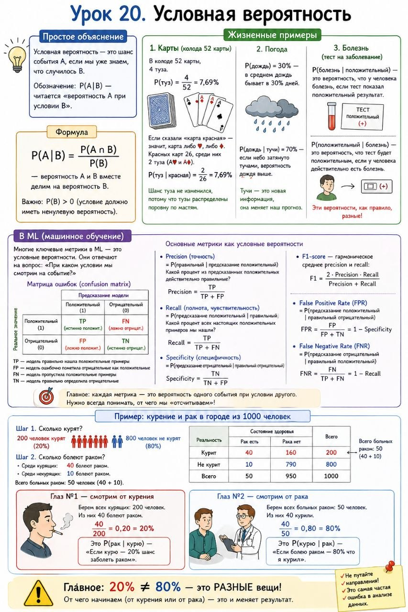

# Урок 20. Условная вероятность

**Номер:** 20

Урок 20. Условная вероятность

Простое объяснение
Условная вероятность — это шанс события A, если мы уже знаем, что случилось B. Обозначение: P(A|B) — читается «вероятность A при условии B».

Жизненные примеры

1. Карты: в колоде 52 карты, 4 туза. P(туз) = 4/52 = 8%. Но если сказали «карта красная» — осталось 26 карт, 2 туза. P(туз | красная) = 2/26 = 8%
2. Погода: P(дождь) = 30%. P(дождь | тучи) = 70% — если небо тёмное, шанс выше
3. Болезнь: P(болезнь | положительный) ≠ P(положительный | болезнь) — это разные вещи!

Формула
P(A|B) = P(A и B) / P(B) — вероятность A и B вместе делим на вероятность B.

В ML
Precision и Recall — это условные вероятности: Precision = P(правильный | предсказание), Recall = P(предсказание | правильный).

Частая ошибка
Путать два направления — самая частая ошибка в анализе данных.

Пример с курением и раком в городе 1000 человек:
Шаг 1. Сколько курят? 200 человек курят, 800 — нет.
Шаг 2. Сколько болеют раком? Среди курящих: 40 болеют. Среди некурящих: 10 болеют. Всего 50.

Глаз №1 — смотрим от курения:
Берем 200 курящих. Из них 40 болеют раком. 40 ÷ 200 = 20%. Это P(рак | курю) — «Если курю — 20% шанс рака».

Глаз №2 — смотрим от рака:Берем 50 больных. Из них 40 курили. 40 ÷ 50 = 80%. Это P(курю | рак) — «Если болею раком — 80% что курил».

Главное: 20% ≠ 80%. Это РАЗНЫЕ вещи! От чего начинаем — вот что меняет результат.
