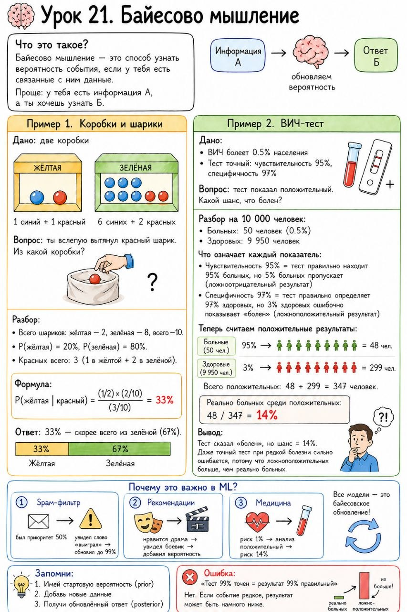

# Урок 21. Байесово мышление

**Номер:** 21

🧠 Урок 21. Байесово мышление

Что это такое?

Байесово мышление — это способ узнать вероятность события, если у тебя есть связанные с ним данные.

Проще: у тебя есть информация А, а ты хочешь узнать Б.

Пример с коробками и шариками

Дано:
• Две коробки: жёлтая и зелёная
• В жёлтой: 1 синий + 1 красный шарик
• В зелёной: 6 синих + 2 красных шарика

Вопрос: ты вслепую вытянул красный шарик. Из какой коробки?

Разбор:
Всего шариков: жёлтая — 2, зелёная — 8, всего — 10.
P(жёлтая) = 20%, P(зелёная) = 80%.
Красных всего: 3 (1 в жёлтой + 2 в зелёной).

Формула:
P(жёлтая | красный) = (1/2) × (2/10) / (3/10) = 33%

Ответ: 33% — скорее всего из зелёной (67%).

Пример из жизни (ВИЧ-тест)

Дано:
• ВИЧ болеет 0.5% населения
• Тест точный: чувствительность 95%, специфичность 97%

Вопрос: тест показал положительный. Какой шанс, что болен?

Разбор на 10 000 человек:
• Больных: 50 человек (0.5%)
• Здоровых: 9 950 человек

Что означает каждый показатель:
• Чувствительность 95% = тест правильно находит 95% больных, но 5% больных пропускает (ложноотрицательный результат)
• Специфичность 97% = тест правильно определяет 97% здоровых, но 3% здоровых ошибочно показывает «болен» (ложноположительный результат)

Теперь считаем положительные результаты:
• Больные: 50 × 95% = 48 человек получат «положительно»
• Здоровые: 9 950 × 3% = 299 человек получат «положительно» (ошибка теста)

Всего положительных: 48 + 299 = 347 человек.
Реально больных среди положительных: 48 / 347 = 14%

Вывод:
Тест сказал «болен», но шанс = 14%.
Даже точный тест при редкой болезни сильно ошибается, потому что ложноположительных больше, чем реально больных.

Почему это важно в ML?

Все модели — это байесовское обновление:

1. Spam-фильтр: был приоритет 50% → увидел слово «выиграл» → обновил до 99%
2. Рекомендации: нравится драма → увидел боевик → добавил вероятность
3. Медицина: риск 1% → анализ положительный → риск 14%

Запомни:

1. Имей стартовую вероятность (prior)
2. Добавь новые данные
3. Получи обновлённый ответ (posterior)

Ошибка:
«Тест 99% точен = результат 99% правильный»

Нет. Если событие редкое, результат может быть намного ниже.
