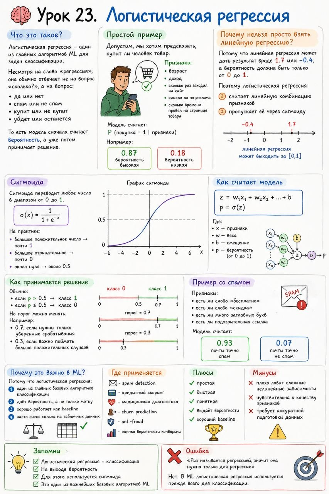

# Урок 23. Логистическая регрессия

**Номер:** 23

🧠 Урок 23. Логистическая регрессия

Что это такое?

Логистическая регрессия — один из главных алгоритмов ML для задач классификации.

Несмотря на слово «регрессия», она обычно отвечает не на вопрос «сколько?», а на вопрос:

• да или нет
• спам или не спам
• купит или не купит
• уйдёт или останется

То есть модель сначала считает вероятность, а уже потом принимает решение.

Простой пример

Допустим, мы хотим предсказать, купит ли человек товар.

Признаки:

• возраст
• доход
• сколько раз заходил на сайт
• кликал ли по рекламе
• сколько времени провёл на странице товара

Модель считает:
P(покупка = 1 | признаки)

Например:

• 0.87 → вероятность высокая
• 0.18 → вероятность низкая

Почему нельзя просто взять линейную регрессию?

Потому что линейная регрессия может дать результат вроде 1.7 или -0.4, а вероятность должна быть только от 0 до 1.

Поэтому логистическая регрессия:

1. считает линейную комбинацию признаков
2. пропускает её через сигмоиду

Сигмоида

Сигмоида переводит любое число в диапазон от 0 до 1.

Формула:
σ(x) = 1 / (1 + e^(-x))

На практике:

• большое положительное число → почти 1
• большое отрицательное → почти 0
• около нуля → около 0.5

Как считает модель

z = w₁x₁ + w₂x₂ + ... + b
p = σ(z)

Где:

• x — признаки
• w — веса
• b — смещение
• p — вероятность

Как принимается решение

Обычно:

• если p > 0.5 → класс 1
• если p ≤ 0.5 → класс 0

Но порог можно менять.
Например:

• 0.7, если нужны только уверенные срабатывания
• 0.3, если важно поймать больше положительных случаев

Пример со спамом

Признаки:

• есть ли слово «бесплатно»
• есть ли слово «скидка»
• есть ли много заглавных букв
• есть ли подозрительная ссылка

Модель считает:

• 0.93 → почти точно спам
• 0.07 → почти точно не спам

Почему это важно в ML?

Потому что логистическая регрессия:

1. один из главных базовых алгоритмов классификации
2. даёт вероятность, а не только метку
3. хорошо работает как baseline
4. часто очень сильна на табличных данных

Где применяется

• spam detection
• кредитный скоринг
• медицинская диагностика
• churn prediction
• anti-fraud
• оценка вероятности конверсии

Плюсы

• простая
• быстрая
• понятная
• выдаёт вероятности
• хороший baseline

Минусы

• плохо ловит сложные нелинейные зависимости
• чувствительна к качеству признаков
• требует аккуратной подготовки данных

Запомни

• Логистическая регрессия = классификация
• На выходе вероятность
• Для этого используется сигмоида
• Это один из важнейших базовых алгоритмов ML

Ошибка

«Раз называется регрессией, значит она нужна только для регрессии»

Нет. В ML логистическая регрессия используется прежде всего для классификации.
