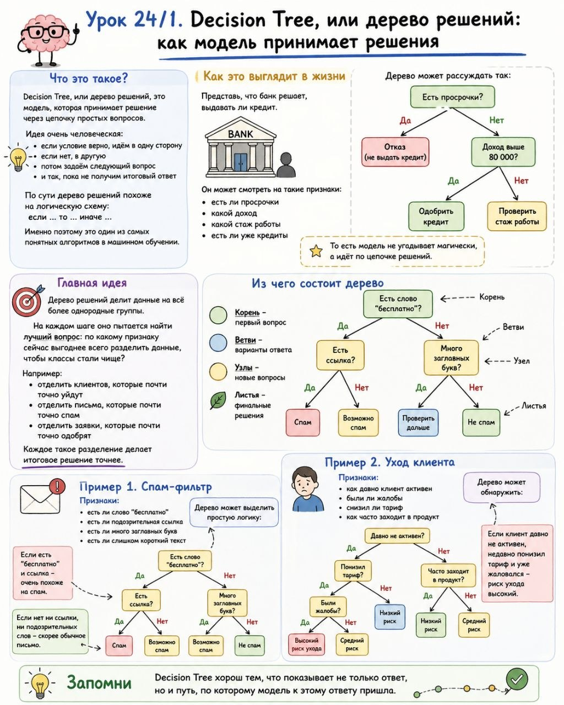

# Урок 24/1. Decision Tree, или дерево решений: как модель принимает решения

**Номер:** 24/1

🧠 Урок 24/1. Decision Tree, или дерево решений: как модель принимает решения

Что это такое?

Decision Tree, или дерево решений, это модель, которая принимает решение через цепочку простых вопросов.

Идея очень человеческая:

• если условие верно, идём в одну сторону
• если нет, в другую
• потом задаём следующий вопрос
• и так, пока не получим итоговый ответ

По сути дерево решений похоже на логическую схему:
если ... то ... иначе ...

Именно поэтому это один из самых понятных алгоритмов в машинном обучении.

Как это выглядит в жизни

Представь, что банк решает, выдавать ли кредит.

Он может смотреть на такие признаки:

• есть ли просрочки
• какой доход
• какой стаж работы
• есть ли уже кредиты

Дерево может рассуждать так:

• есть просрочки?
  • да, отказ
  • нет, идём дальше
• доход выше 80 000?
  • да, одобрить
  • нет, проверить стаж работы

То есть модель не угадывает магически, а идёт по цепочке решений.

Главная идея

Дерево решений делит данные на всё более однородные группы.

На каждом шаге оно пытается найти лучший вопрос:

по какому признаку сейчас выгоднее всего разделить данные, чтобы классы стали чище?

Например:

• отделить клиентов, которые почти точно уйдут
• отделить письма, которые почти точно спам
• отделить заявки, которые почти точно одобрят

Каждое такое разделение делает итоговое решение точнее.

Из чего состоит дерево

У дерева есть:

• корень, первый вопрос
• ветви, варианты ответа
• узлы, новые вопросы
• листья, финальные решения

Например:

• есть слово “бесплатно”?
  • да
    • есть ссылка?
      • да, спам
      • нет, возможно спам
  • нет
    • много заглавных букв?
      • да, проверить дальше
      • нет, не спам

Это и есть дерево решений в действии.

Пример 1. Спам-фильтр

Признаки:

• есть ли слово “бесплатно”
• есть ли подозрительная ссылка
• есть ли много заглавных букв
• есть ли слишком короткий текст

Дерево может выделить простую логику:

• если есть “бесплатно” и ссылка, очень похоже на спам
• если нет ни ссылки, ни подозрительных слов, скорее обычное письмо

Пример 2. Уход клиента

Признаки:

• как давно клиент активен
• были ли жалобы
• снизил ли тариф
• как часто заходит в продукт

Дерево может обнаружить:

• если клиент давно не активен
• недавно понизил тариф
• и уже жаловался

то риск ухода высокий.

Запомни

Decision Tree хорош тем, что показывает не только ответ, но и путь, по которому модель к этому ответу пришла.
