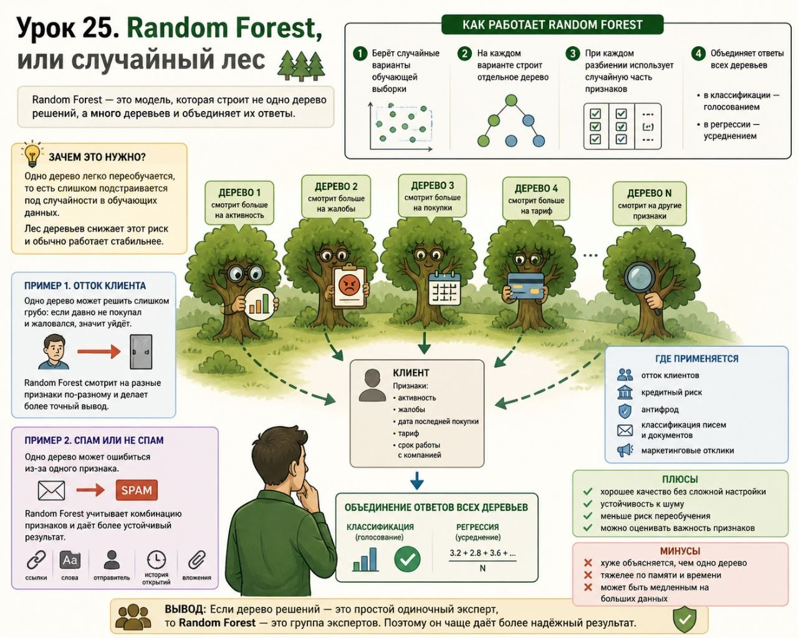

# Урок 25. Random Forest, или случайный лес

**Номер:** 25

Урок 25. Random Forest, или случайный лес

Random Forest — это модель, которая строит не одно дерево решений, а много деревьев и объединяет их ответы.

Зачем это нужно:
одно дерево легко переобучается, то есть слишком подстраивается под случайности в обучающих данных.
Лес деревьев снижает этот риск и обычно работает стабильнее.

Как работает Random Forest

1. Берёт случайные варианты обучающей выборки
2. На каждом варианте строит отдельное дерево
3. При каждом разбиении использует случайную часть признаков
4. Объединяет ответы всех деревьев:

• в классификации — голосованием
• в регрессии — усреднением

Пример 1. Отток клиента
Нужно предсказать, уйдёт ли клиент.

Признаки:

• активность
• жалобы
• дата последней покупки
• тариф
• срок работы с компанией

Одно дерево может решить слишком грубо:
если давно не покупал и жаловался, значит уйдёт.

Random Forest строит много деревьев. Одни смотрят больше на активность, другие на жалобы, третьи на покупки. Итоговое решение получается точнее.

Пример 2. Спам или не спам
Нужно определить, является ли письмо спамом.

Признаки:

• количество ссылок
• слова вроде «скидка», «бесплатно», «срочно»
• адрес отправителя
• история прошлых открытий
• вложения

Одно дерево может ошибиться из-за одного признака.
Random Forest смотрит на комбинацию признаков и даёт более устойчивый результат.

Где применяется

• отток клиентов
• кредитный риск
• антифрод
• классификация писем и документов
• маркетинговые отклики

Плюсы

• хорошее качество без сложной настройки
• устойчивость к шуму
• меньше риск переобучения
• можно оценивать важность признаков

Минусы

• хуже объясняется, чем одно дерево
• тяжелее по памяти и времени
• может быть медленным на больших данных

Вывод
Если дерево решений — это простой одиночный эксперт, то Random Forest — это группа экспертов. Поэтому он чаще даёт более надёжный результат.
