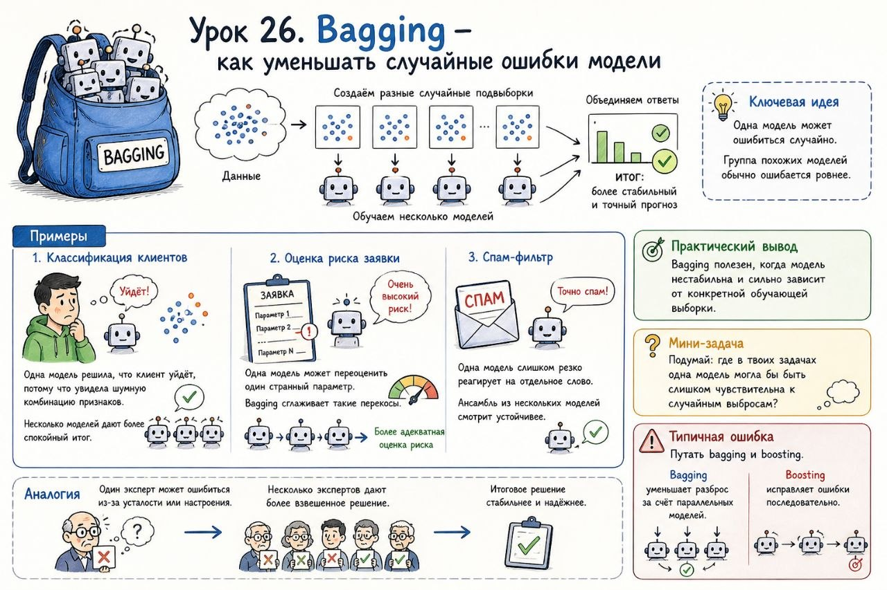

# Урок 26. Bagging — как уменьшать случайные ошибки модели

**Номер:** 26

Урок 26. Bagging — как уменьшать случайные ошибки модели

Bagging (Bootstrap Aggregating) — это способ сделать модель стабильнее за счёт нескольких версий одной и той же модели.

Простое объяснение

Одна модель может случайно переоценить шум в данных.
Bagging решает это так: мы обучаем несколько моделей на разных случайных подвыборках, а потом объединяем ответы.

Ключевая идея

Одна модель может ошибиться случайно.
Группа похожих моделей обычно ошибается ровнее.

Примеры

1. Классификация клиентов
Одна модель решила, что клиент уйдёт, потому что увидела шумную комбинацию признаков.
Несколько моделей дают более спокойный итог.
2. Оценка риска заявки
Одна модель может переоценить один странный параметр.
Bagging сглаживает такие перекосы.
3. Спам-фильтр
Одна модель слишком резко реагирует на отдельное слово.
Ансамбль из нескольких моделей смотрит устойчивее.

Практический вывод

Bagging полезен, когда модель нестабильна и сильно зависит от конкретной обучающей выборки.

Мини-задача

Подумай: где в твоих задачах одна модель могла бы быть слишком чувствительна к случайным выбросам?

Типичная ошибка

Путать bagging и boosting.
Bagging уменьшает разброс за счёт параллельных моделей.
Boosting исправляет ошибки последовательно.
