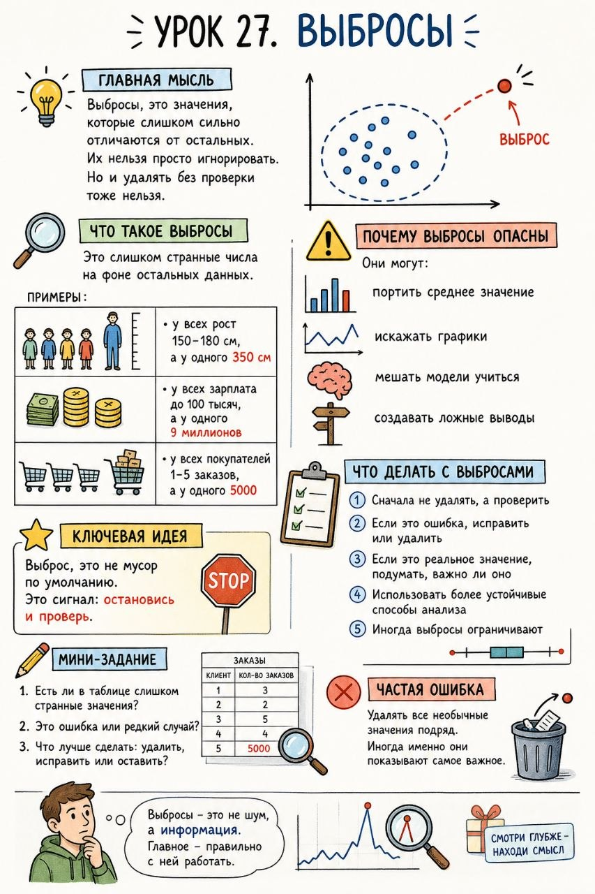

# Урок 27. Выбросы

**Номер:** 27

## Урок 27. Выбросы

Главная мысль
Выбросы, это значения, которые слишком сильно отличаются от остальных. Их нельзя просто игнорировать. Но и удалять без проверки тоже нельзя.

Что такое выбросы
Это слишком странные числа на фоне остальных данных.

Примеры:
- у всех рост 150–180 см, а у одного 350 см
- у всех зарплата до 100 тысяч, а у одного 9 миллионов
- у всех покупателей 1–5 заказов, а у одного 5000

Почему выбросы опасны
Они могут:
- портить среднее значение
- искажать графики
- мешать модели учиться
- создавать ложные выводы

Что делать с выбросами
1. Сначала не удалять, а проверить
2. Если это ошибка, исправить или удалить
3. Если это реальное значение, подумать, важно ли оно
4. Использовать более устойчивые способы анализа
5. Иногда выбросы ограничивают

Ключевая идея
Выброс, это не мусор по умолчанию. Это сигнал: остановись и проверь.

Мини-задание
1. Есть ли в таблице слишком странные значения?
2. Это ошибка или редкий случай?
3. Что лучше сделать: удалить, исправить или оставить?

Частая ошибка
Удалять все необычные значения подряд. Иногда именно они показывают самое важное.
