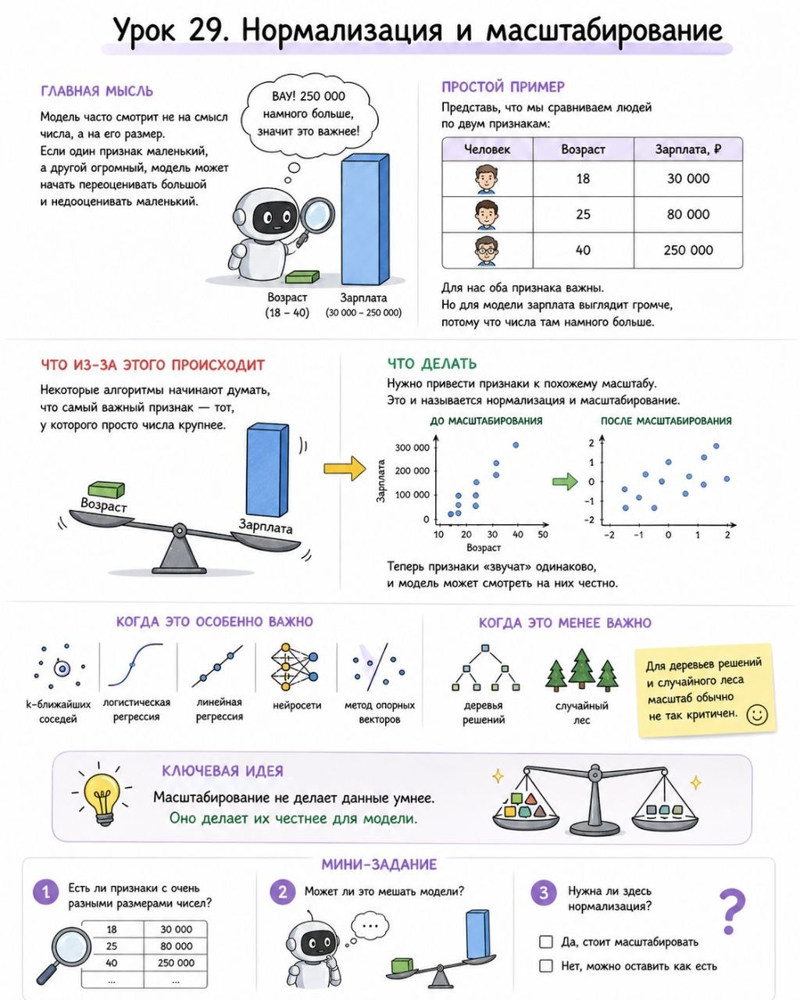

# Урок 29. Нормализация и масштабирование

**Номер:** 29

## Урок 29. Нормализация и масштабирование

Главная мысль
Модель часто смотрит не на смысл числа, а на его размер. Если один признак маленький, а другой огромный, модель может начать переоценивать большой и недооценивать маленький.

Простой пример
Представь, что мы сравниваем людей по двум признакам:
- возраст: 18, 25, 40
- зарплата: 30 000, 80 000, 250 000

Для нас оба признака важны. Но для модели зарплата выглядит громче, потому что числа там намного больше.

Что из-за этого происходит
Некоторые алгоритмы начинают думать, что самый важный признак — тот, у которого просто числа крупнее.

Что делать
Нужно привести признаки к похожему масштабу. Это и называется нормализация и масштабирование.

### Когда это особенно важно
- k-ближайших соседей
- логистическая регрессия
- линейная регрессия
- нейросети
- метод опорных векторов

### Когда это менее важно
Для деревьев решений и случайного леса масштаб обычно не так критичен.

Ключевая идея
Масштабирование не делает данные умнее. Оно делает их честнее для модели.

Мини-задание
1. Есть ли признаки с очень разными размерами чисел?
2. Может ли это мешать модели?
3. Нужна ли здесь нормализация?
