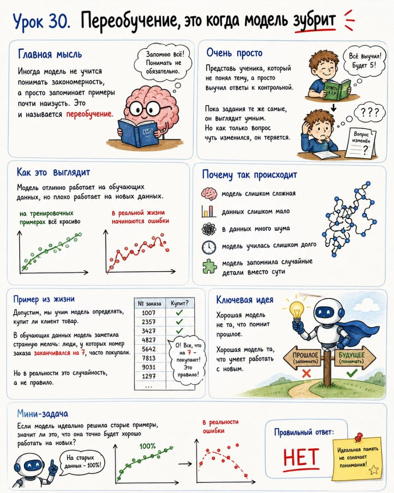

# Урок 30. Переобучение, это когда модель зубрит

**Номер:** 30

## Урок 30. Переобучение, это когда модель зубрит

Главная мысль
Иногда модель не учится понимать закономерность, а просто запоминает примеры почти наизусть. Это и называется переобучение.

Очень просто
Представь ученика, который не понял тему, а просто выучил ответы к контрольной. Пока задания те же самые, он выглядит умным. Но как только вопрос чуть изменился, он теряется.

Как это выглядит
Модель отлично работает на обучающих данных, но плохо работает на новых данных.

То есть:
- на тренировочных примерах всё красиво
- в реальной жизни начинаются ошибки

Почему так происходит
- модель слишком сложная
- данных слишком мало
- в данных много шума
- модель училась слишком долго
- модель запомнила случайные детали вместо сути

Пример из жизни
Допустим, мы учим модель определять, купит ли клиент товар. В обучающих данных модель заметила странную мелочь: люди, у которых номер заказа заканчивался на 7, часто покупали. Но в реальности это случайность, а не правило.

Ключевая идея
Хорошая модель не та, что помнит прошлое. Хорошая модель та, что умеет работать с новым.

Мини-задача
Если модель идеально решила старые примеры, значит ли это, что она точно будет хорошо работать на новых? Правильный ответ: нет.
