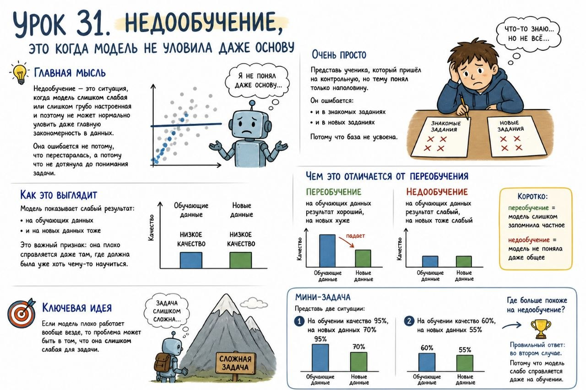

# Урок 31. Недообучение, это когда модель не уловила даже основу

**Номер:** 31

## Урок 31. Недообучение, это когда модель не уловила даже основу

Главная мысль
Недообучение — это ситуация, когда модель слишком слабая или слишком грубо настроенная и поэтому не может нормально уловить даже главную закономерность в данных.

Она ошибается не потому, что перестаралась, а потому что не дотянула до понимания задачи.

Очень просто
Представь ученика, который пришёл на контрольную, но тему понял только наполовину.

Он ошибается:
- и в знакомых заданиях
- и в новых заданиях

Потому что база не усвоена.

Как это выглядит
Модель показывает слабый результат:
- на обучающих данных
- и на новых данных тоже

Это важный признак: она плохо справляется даже там, где должна была уже хоть чему-то научиться.

Чем это отличается от переобучения
Переобучение:
- на обучающих данных результат хороший
- на новых хуже

Недообучение:
- на обучающих данных результат слабый
- на новых тоже слабый

Коротко:
переобучение = модель слишком запомнила частное
недообучение = модель не поняла даже общее

Ключевая идея
Если модель плохо работает вообще везде, то проблема может быть в том, что она слишком слабая для задачи.

Мини-задача
Представь две ситуации:
1. На обучении качество 95%, на новых данных 70%
2. На обучении качество 60%, на новых данных 55%

Где больше похоже на недообучение?
Правильный ответ: во втором случае. Потому что модель слабо справляется даже на обучении.
