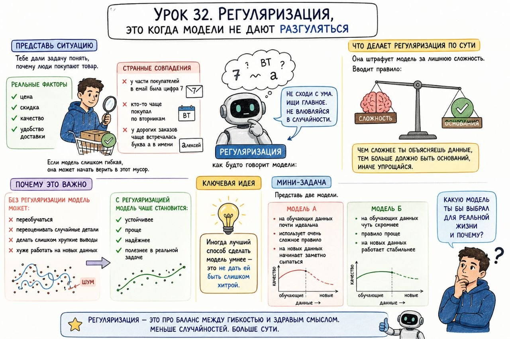

# Урок 32. Регуляризация, это когда модели не дают разгуляться

**Номер:** 32

## Урок 32. Регуляризация, это когда модели не дают разгуляться

Главная мысль
Одна из частых проблем в ML такая: модель становится слишком ловкой. Она не просто находит важные закономерности, а начинает хвататься за каждую мелочь, шум, случайность и мусор.

В итоге на обучении она выглядит почти гениально, а в реальности начинает ошибаться.

Регуляризация — это способ немного ограничить модель, чтобы она не переусложняла решение без необходимости.

Представь ситуацию
Тебе дали задачу понять, почему люди покупают товар.

Есть реальные факторы:
- цена
- скидка
- качество
- удобство доставки

Но модель вдруг замечает ещё и странные совпадения:
- у части покупателей в email была цифра 7
- кто-то чаще покупал по вторникам
- у дорогих заказов чаще встречалась буква a в имени

Если модель слишком гибкая, она может начать верить в этот мусор.

И вот тут регуляризация как будто говорит ей:
Не сходи с ума. Ищи главное. Не влюбляйся в случайности.

Что делает регуляризация по сути
Она штрафует модель за лишнюю сложность.

То есть как будто вводит правило:
- чем сложнее ты объясняешь данные,
- тем больше должно быть оснований,
- иначе упрощайся.

Почему это важно
Без регуляризации модель может начать:
- переобучаться
- переоценивать случайные детали
- делать слишком хрупкие выводы
- хуже работать на новых данных

С регуляризацией модель чаще становится:
- устойчивее
- проще
- надёжнее
- полезнее в реальной задаче

Ключевая идея
Иногда лучший способ сделать модель умнее — это не дать ей быть слишком хитрой.

Мини-задача
Представь две модели.

Модель А:
- на обучающих данных почти идеальна
- использует очень сложное правило
- на новых данных начинает заметно сыпаться

Модель Б:
- на обучающих данных чуть скромнее
- правило проще
- на новых данных работает стабильнее

Какую модель ты бы выбрал для реальной жизни и почему?
