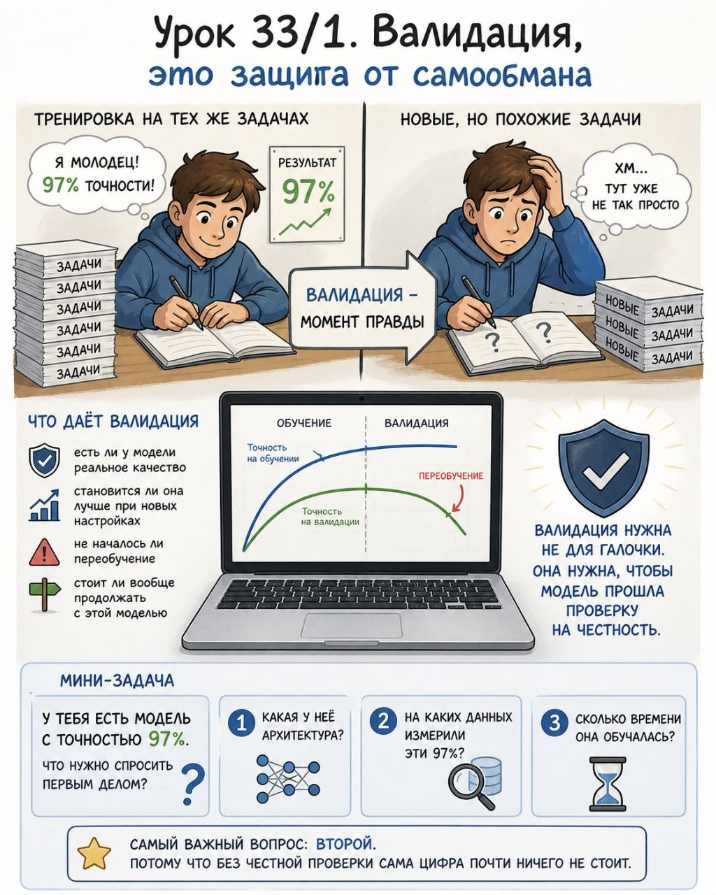

# Урок 33/1. Валидация, это защита от самообмана

**Номер:** 33/1

## Урок 33/1. Валидация, это защита от самообмана

Главная мысль
В ML одна из самых частых ловушек очень простая: модель показывает красивый результат, и хочется сразу поверить, что всё получилось.

Но красивая цифра ещё не значит, что модель реально работает.

Может оказаться, что она просто хорошо запомнила знакомые данные.

Именно поэтому нужна валидация. Это способ не влюбиться в модель раньше времени.

Представь простую ситуацию
Ты готовишь человека к экзамену.

Если он сто раз прорешал один и тот же набор задач, то на этих задачах он может выглядеть блестяще.

Но это не ответ на главный вопрос:
А что будет, если дать ему новые, но похожие задания?

Вот валидация в ML и есть такой момент правды.

Что даёт валидация
Она помогает понять:
- есть ли у модели реальное качество
- становится ли она лучше при новых настройках
- не началось ли переобучение
- стоит ли вообще продолжать с этой моделью

Ключевая идея
Валидация нужна не для галочки. Она нужна, чтобы модель прошла проверку на честность.

Мини-задача
У тебя есть модель с точностью 97%.
Что нужно спросить первым делом?
1. Какая у неё архитектура?
2. На каких данных измерили эти 97%?
3. Сколько времени она обучалась?

Самый важный вопрос: второй. Потому что без честной проверки сама цифра почти ничего не стоит.
