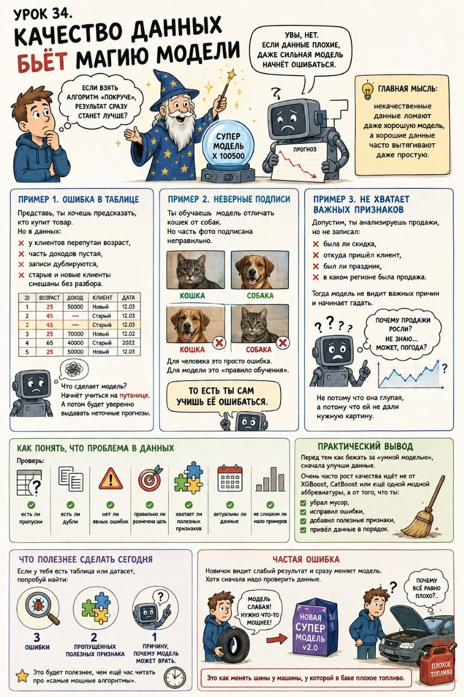

# Урок 34. Качество данных бьёт магию модели

**Номер:** 34

Урок 34. Качество данных бьёт магию модели

Многие новички думают так:
если взять алгоритм «покруче», результат сразу станет лучше.

Увы, нет.

Если данные плохие, даже сильная модель начнёт ошибаться.
Потому что модель не думает сама. Она учится на том, что ты ей дал.

Главная мысль:
некачественные данные ломают даже хорошую модель, а хорошие данные часто вытягивают даже простую.

Пример 1. Ошибка в таблице
Представь, ты хочешь предсказать, кто купит товар.
Но в данных:
- у клиентов перепутан возраст,
- часть доходов пустая,
- записи дублируются,
- старые и новые клиенты смешаны без разбора.

Что сделает модель?
Начнёт учиться на путанице.
А потом будет уверенно выдавать неточные прогнозы.

Пример 2. Неверные подписи
Ты обучаешь модель отличать кошек от собак.
Но часть фото подписана неправильно.

Для человека это просто ошибка.
Для модели это «правило обучения».

То есть ты сам учишь её ошибаться.

Пример 3. Не хватает важных признаков
Допустим, ты анализируешь продажи, но не записал:
- была ли скидка,
- откуда пришёл клиент,
- был ли праздник,
- в каком регионе была продажа.

Тогда модель не видит важных причин и начинает гадать.
Не потому что она глупая, а потому что ей не дали нужную картину.

Как понять, что проблема в данных
Проверь:
- есть ли пропуски,
- есть ли дубли,
- нет ли явных ошибок,
- правильно ли размечена цель,
- хватает ли полезных признаков,
- актуальны ли данные,
- не слишком ли мало примеров.

Практический вывод
Перед тем как бежать за «умной моделью», сначала улучши данные.

Очень часто рост качества идёт не от XGBoost, CatBoost или ещё одной модной аббревиатуры,
а от того, что ты:
- убрал мусор,
- исправил ошибки,
- добавил полезные признаки,
- привёл данные в порядок.

Что полезнее сделать сегодня
Если у тебя есть таблица или датасет, попробуй найти:
- 3 ошибки,
- 2 пропущенных полезных признака,
- 1 причину, почему модель может врать.

Это будет полезнее, чем ещё час читать про «самые мощные алгоритмы».

Частая ошибка
Новичок видит слабый результат и сразу меняет модель.
Хотя сначала надо проверить данные.

Это как менять шины у машины, у которой в баке плохое топливо.
