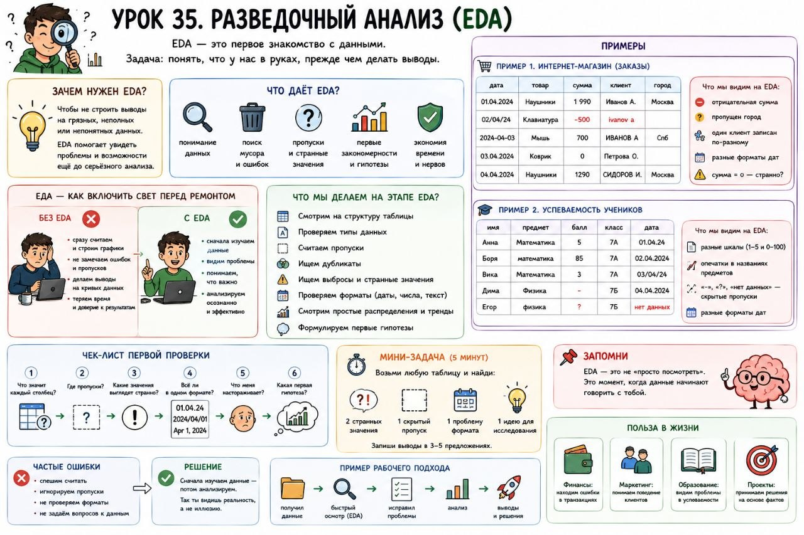

# Урок 35. Разведочный анализ.

**Номер:** 35

**Урок 35. Разведочный анализ.
EDA (Exploratory Data Analysis), это момент, когда данные впервые начинают говорить**

Одна из самых частых ошибок новичка в аналитике и ML такая:
он открывает таблицу и сразу хочет что-то считать, строить графики или обучать модель.

А надо сначала остановиться и задать простой вопрос:

Что вообще у меня в руках?

Вот это и есть EDA, разведочный анализ данных.
Не магия, не сложная наука, а первое нормальное знакомство с данными.

Главная мысль:
EDA нужен, чтобы не делать умный вид над таблицей, которую ты ещё толком не понял.

Если сказать совсем просто:
EDA — это когда ты включаешь свет перед ремонтом.

Без этого можно очень бодро идти не туда.

Что даёт EDA
Он помогает:
- понять, какие данные перед тобой;
- быстро заметить мусор;
- увидеть пропуски и ошибки;
- поймать первые закономерности;
- не строить выводы на кривом основании.

Пример 1. Продажи
У тебя таблица с заказами:
- дата,
- товар,
- сумма,
- клиент,
- город.

Кажется, можно уже “что-то анализировать”.
Но потом ты замечаешь:
- часть сумм отрицательная,
- у половины строк не указан город,
- один и тот же клиент записан по-разному,
- даты хранятся в трёх форматах.

Если ты это не увидел в начале, дальше весь анализ будет как дом на мокром картоне.

Пример 2. Оценки учеников
Есть данные по школьникам:
- имя,
- предмет,
- балл,
- класс.

На вид всё аккуратно.
А потом выясняется:
- в одном месте баллы по шкале от 1 до 5,
- в другом от 0 до 100,
- часть предметов написана с опечатками,
- пустые значения спрятаны как “-”, “?” и “нет данных”.

Если ты просто посчитаешь среднее, получится не аналитика, а иллюзия аккуратности.

Что обычно делают на этапе EDA
- смотрят на столбцы;
- проверяют типы данных;
- считают пропуски;
- ищут странные и выбивающиеся значения;
- смотрят повторы;
- пытаются понять, какие признаки вообще полезны;
- замечают первые гипотезы.

То есть EDA — это момент, когда ты перестаёшь смотреть на таблицу как на набор клеток
и начинаешь видеть в ней поведение, ошибки, структуру и смысл.

Почему это реально важно
Очень часто хороший специалист отличается от слабого не тем, что знает больше алгоритмов,
а тем, что раньше замечает:
- где данные врут,
- где таблица грязная,
- где формат сломан,
- где выводы будут фальшивыми.

Практический вывод
Не надо спешить в “умный анализ”.
Сначала разберись, что перед тобой.

Иногда 15 минут честного EDA экономят несколько часов бессмысленной работы и спасают от позорных выводов.

Полезный мини-чек
Открыл таблицу? Спроси сразу:
1. что значит каждый столбец?
2. где тут пропуски?
3. какие значения выглядят странно?
4. всё ли в одном формате?
5. что меня уже сейчас настораживает?
6. какая первая гипотеза напрашивается сама?

Мини-задача
Возьми любую таблицу и за 5 минут найди:
- 2 странных значения,
- 1 скрытый пропуск,
- 1 проблему формата,
- 1 идею, что тут можно исследовать дальше.

Частая ошибка
Новичок думает:
EDA — это “просто посмотреть на таблицу”.

Нет.
EDA — это первый момент, когда данные либо начинают с тобой разговаривать, либо ты продолжаешь смотреть на них слепым взглядом.
