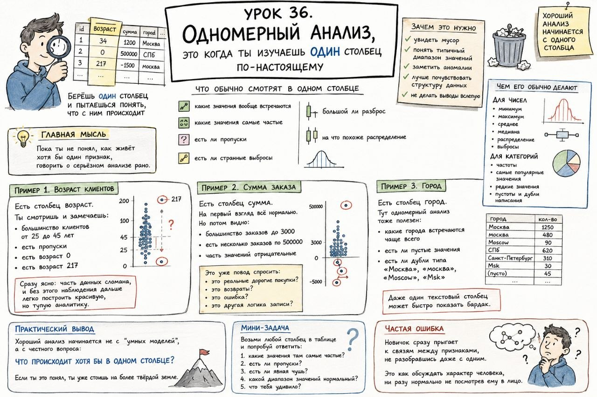

# Урок 36. Одномерный анализ, это когда ты изучаешь один столбец по-настоящему

**Номер:** 36

Урок 36. Одномерный анализ, это когда ты изучаешь один столбец по-настоящему

После первого знакомства с таблицей хочется понять не всё сразу, а хотя бы один признак нормально.

Вот это и есть одномерный анализ.

Если совсем просто:
ты берёшь один столбец и пытаешься понять, что с ним происходит.

Не два, не пять, не всю таблицу целиком.
Сначала один.

Главная мысль:
пока ты не понял, как живёт хотя бы один признак, говорить о серьёзном анализе рано.

Что обычно смотрят в одном столбце
- какие значения вообще встречаются;
- какие значения самые частые;
- есть ли пропуски;
- есть ли странные выбросы;
- большой ли разброс;
- на что похоже распределение.

Пример 1. Возраст клиентов
Есть столбец возраст.

Ты смотришь и замечаешь:
- большинство клиентов от 25 до 45 лет;
- есть пропуски;
- есть возраст 0;
- есть возраст 217.

Сразу ясно:
часть данных сломана, и без этого наблюдения дальше легко построить красивую, но тупую аналитику.

Пример 2. Сумма заказа
Есть столбец сумма.

На первый взгляд всё нормально.
Но потом видно:
- большинство заказов до 3000;
- есть несколько заказов по 500000;
- часть значений отрицательные.

Это уже повод спросить:
- это реальные дорогие покупки?
- это возвраты?
- это ошибка?
- это другая логика записи?

Пример 3. Город
Есть столбец город.

Тут одномерный анализ тоже полезен:
- какие города встречаются чаще всего;
- есть ли пустые значения;
- есть ли дубли типа Москва, москва, Moscow, Msk.

То есть даже один текстовый столбец может быстро показать бардак.

Зачем это нужно
Одномерный анализ помогает:
- увидеть мусор,
- понять типичный диапазон значений,
- заметить аномалии,
- лучше почувствовать структуру данных,
- не делать выводы вслепую.

Чем его обычно делают
Для чисел часто смотрят:
- минимум,
- максимум,
- среднее,
- медиану,
- распределение,
- выбросы.

Для категорий:
- частоты,
- самые популярные значения,
- редкие значения,
- пустоты и дубли написания.

Практический вывод
Хороший анализ начинается не с “умных моделей”,
а с честного вопроса:

что происходит хотя бы в одном столбце?

Если ты это понял, ты уже стоишь на более твёрдой земле.

Мини-задача
Возьми любой столбец в таблице и попробуй ответить:
1. какие значения там самые частые?
2. есть ли пропуски?
3. есть ли явная чушь?
4. какой диапазон значений нормальный?
5. что тебя удивило?

Частая ошибка
Новичок сразу прыгает к связям между признаками,
не разобравшись даже с одним.

Это как обсуждать характер человека, ни разу нормально не посмотрев ему в лицо.
