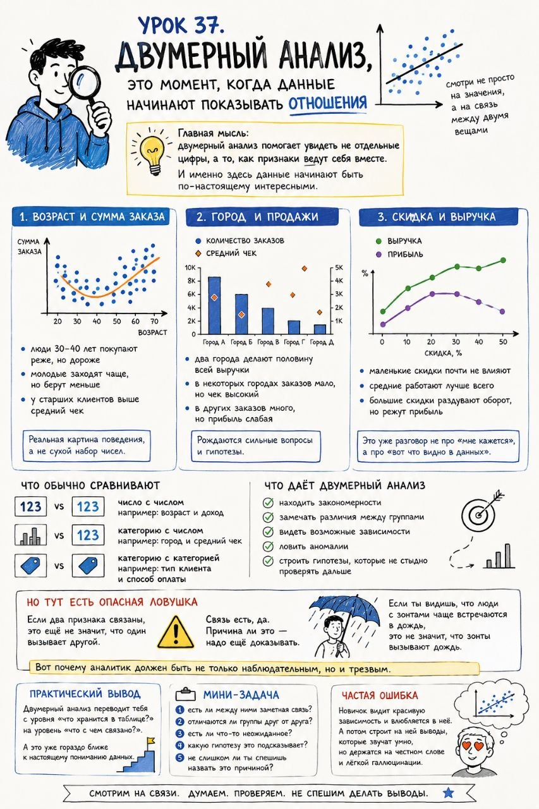

# Урок 37. Двумерный анализ, это момент, когда данные начинают показывать отношения

**Номер:** 37

Урок 37. Двумерный анализ, это момент, когда данные начинают показывать отношения

На прошлом шаге мы смотрели на один столбец.
Это полезно, но довольно ограниченно.

Потому что бизнес, жизнь и данные почти никогда не живут по одному признаку.

Настоящее понимание начинается в тот момент, когда ты смотришь не просто на значения,
а на связь между двумя вещами.

Вот это и есть двумерный анализ.

Главная мысль:
двумерный анализ помогает увидеть не отдельные цифры, а то, как признаки ведут себя вместе.

И именно здесь данные начинают быть по-настоящему интересными.

Простой пример 1. Возраст и сумма заказа
Есть два столбца:
- возраст клиента,
- сумма заказа.

По отдельности они мало что говорят.
Но если посмотреть их вместе, может оказаться, например, что:
- люди 30–40 лет покупают реже, но дороже,
- молодые заходят чаще, но берут меньше,
- у старших клиентов выше средний чек.

И вот это уже похоже на реальную картину поведения, а не на сухой набор чисел.

Простой пример 2. Город и продажи
Есть:
- город,
- количество заказов.

Смотришь и видишь:
- два города делают половину всей выручки,
- в некоторых городах заказов мало, но чек высокий,
- в других заказов много, но прибыль слабая.

Сразу рождаются сильные вопросы:
- где работает реклама,
- где хороший спрос,
- где слабая конверсия,
- куда вообще стоит вкладываться.

Простой пример 3. Скидка и выручка
Кажется логичным:
чем больше скидка, тем лучше продажи.

Но двумерный анализ может показать:
- маленькие скидки почти не влияют,
- средние работают лучше всего,
- большие скидки раздувают оборот, но режут прибыль.

И это уже разговор не про “мне кажется”,
а про “вот что видно в данных”.

Что обычно сравнивают
- число с числом
  например: возраст и доход
- категорию с числом
  например: город и средний чек
- категорию с категорией
  например: тип клиента и способ оплаты

Что даёт двумерный анализ
Он помогает:
- находить закономерности,
- замечать различия между группами,
- видеть возможные зависимости,
- ловить аномалии,
- строить гипотезы, которые не стыдно проверять дальше.

Но тут есть опасная ловушка
Если два признака связаны, это ещё не значит, что один вызывает другой.

Связь есть, да.
Причина ли это, надо ещё доказывать.

Иначе начинается любимый жанр плохой аналитики:
увидел красивую зависимость, придумал красивое объяснение, поверил в него раньше времени.

Самый простой образ
Если ты видишь, что люди с зонтами чаще встречаются в дождь,
это не значит, что зонты вызывают дождь.

Вот почему аналитик должен быть не только наблюдательным, но и трезвым.

Практический вывод
Двумерный анализ переводит тебя с уровня
«что хранится в таблице?»
на уровень
«что с чем связано?»

А это уже гораздо ближе к настоящему пониманию данных.

Мини-задача
Возьми любые 2 столбца и попробуй ответить:
1. есть ли между ними заметная связь?
2. отличаются ли группы друг от друга?
3. есть ли что-то неожиданное?
4. какую гипотезу это подсказывает?
5. не слишком ли ты спешишь назвать это причиной?

Частая ошибка
Новичок видит красивую зависимость и влюбляется в неё.

А потом строит на ней выводы, которые звучат умно,
но держатся на честном слове и лёгкой галлюцинации.
