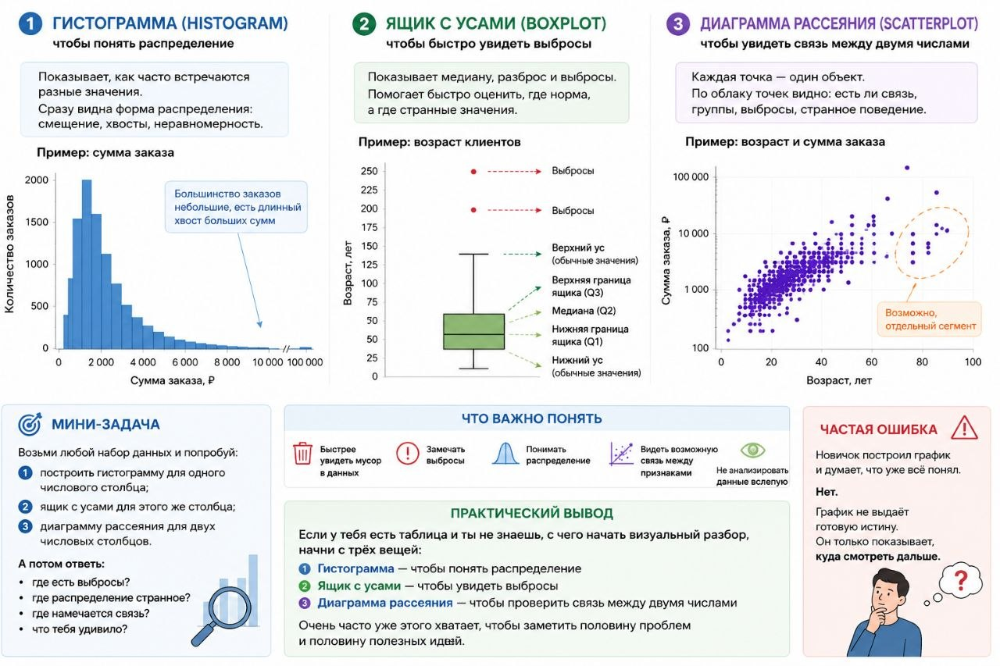

# Урок 38. Гистограмма (histogram), ящик с усами (boxplot) и диаграмма рассеяния (scatterplot), это быстрый способ увидеть, что происходит в данных

**Номер:** 38

Урок 38. Гистограмма (histogram), ящик с усами (boxplot) и диаграмма рассеяния (scatterplot), это быстрый способ увидеть, что происходит в данных

Когда смотришь на таблицу просто глазами, многое можно не заметить.
А хороший график часто показывает проблему быстрее, чем длинные расчёты.

Есть три очень полезных инструмента, с которых реально стоит начинать:

- гистограмма (histogram)
- ящик с усами / диаграмма размаха (boxplot)
- диаграмма рассеяния (scatterplot)

Если говорить совсем просто, это три способа спросить у данных:

«Что у вас тут вообще творится?»

---

1. Гистограмма (histogram), чтобы понять распределение

Гистограмма показывает,
как часто встречаются разные значения.

Например, есть столбец сумма заказа.

Гистограмма может быстро показать:
- большинство заказов маленькие,
- есть длинный хвост больших сумм,
- данные перекошены,
- значения распределены неравномерно.

То есть ты сразу видишь форму данных.

Пример:
Если почти все заказы до 3000, а потом торчат редкие 100000+,
значит у тебя либо очень дорогие клиенты, либо выбросы, либо ошибка в данных.

---

2. Ящик с усами (boxplot), чтобы быстро увидеть выбросы

Ящик с усами хорош тем, что сразу показывает:
- где середина данных,
- насколько велик разброс,
- есть ли выбросы.

Это особенно полезно, когда нужно быстро проверить числовой столбец.

Пример:
Если по возрасту на графике отдельно торчат точки 180 или 250,
значит в данных что-то пошло не туда.

Этот график хорош своей честностью.
Он как строгий преподаватель:
вот здесь норма, а вот здесь уже странности.

---

3. Диаграмма рассеяния (scatterplot), чтобы увидеть связь между двумя числами

Этот график нужен, когда у тебя есть два числовых признака,
и ты хочешь понять, связаны ли они между собой.

Например:
- возраст и сумма заказа,
- рекламный бюджет и продажи,
- цена и спрос.

Каждая точка — это один объект.
И по облаку точек можно быстро заметить:
- есть ли связь,
- есть ли группы,
- есть ли выбросы,
- нет ли странного поведения в данных.

Пример:
Если точки тянутся вверх, возможно, один показатель растёт вместе с другим.
Если всё лежит хаотично, связи может почти не быть.
Если вдруг выделяется отдельная группа точек, значит, там может быть особый сегмент.

---

Что важно понять
Эти графики нужны не “для красоты”.

Они помогают:
- быстрее увидеть мусор,
- заметить выбросы,
- понять распределение,
- увидеть возможную связь между признаками,
- не анализировать данные вслепую.

---

Практический вывод
Если у тебя есть таблица и ты не знаешь, с чего начать визуальный разбор,
начни с трёх вещей:

- гистограмма (histogram) — чтобы понять распределение
- ящик с усами (boxplot) — чтобы увидеть выбросы
- диаграмма рассеяния (scatterplot) — чтобы проверить связь между двумя числами

Очень часто уже этого хватает, чтобы заметить половину проблем и половину полезных идей.

---

Мини-задача
Возьми любой набор данных и попробуй:
1. построить гистограмму (histogram) для одного числового столбца,
2. ящик с усами (boxplot) для этого же столбца,
3. диаграмму рассеяния (scatterplot) для двух числовых столбцов.

А потом ответь:
- где есть выбросы?
- где распределение странное?
- где намечается связь?
- что тебя удивило?

---

Частая ошибка
Новичок построил график и думает, что уже всё понял.

Нет.
График не выдаёт готовую истину.
Он только показывает, куда смотреть дальше.
