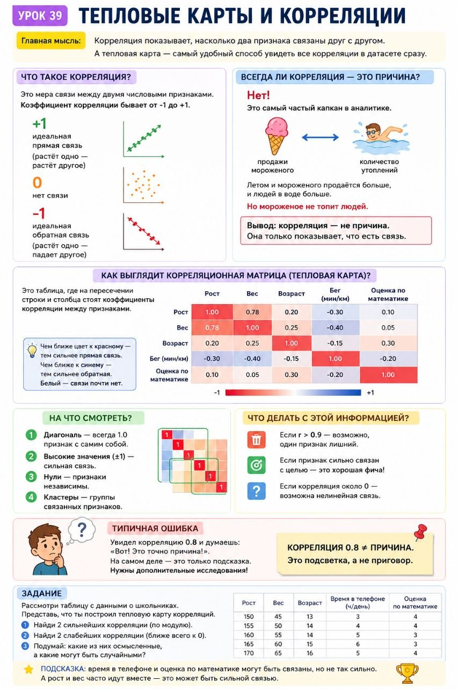

# Урок 39: Тепловые карты и корреляции

**Номер:** 39

Урок 39: Тепловые карты и корреляции

Главная мысль: Тепловая карта — это простой и наглядный способ увидеть, какие признаки в данных связаны друг с другом.

1. Что такое тепловая карта: прогноз погоды, карта пробок — цвета показывают значения. В аналитике цвет показывает силу связи.

2. Связь между признаками: сильная (площадь→цена), слабая (этаж→цена), обратная (старше машина→дешевле), нет (цвет волос→цена).

3. Как читать: квадратная таблица. По диагонали — самый яркий. Яркие пятна — сильные связи. Серые зоны — нет связи.

4. Что делать: логично (используй), неожиданно (копай), ловушка (один убрать).

5. Главная ошибка: связь≠причина. Мороженое и ожоги связаны, но мороженое не вызывает ожоги.

6. Корреляция:  1 идеальная, 0 нет, -1 обратная. 0.8 сильная, 0.3 слабая.

7. Где ещё: продажи, клики, пропуски, оценки.

Запомни: цвета вместо чисел; яркий=связь; связь≠причина; два ярких→один лишний; яркий с целью→кандидат.

Задание: Какие два признака ярко связаны? Какие серые? Зарплата и кредит — причина или связь?
