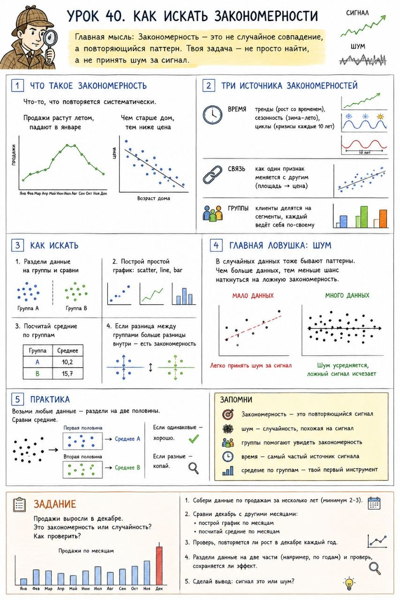

# Урок 40. Как искать закономерности

**Номер:** 40

Урок 40. Как искать закономерности

Главная мысль: Закономерность — это не случайное совпадение, а повторяющийся паттерн. Твоя задача — не просто найти, а не принять шум за сигнал.

1. Что такое закономерность: продажи растут летом, падают в январе; чем старше дом, тем ниже цена. Что-то, что повторяется систематически.

2. Три источника закономерностей:
— Время: тренды (рост со временем), сезонность (зима-лето), циклы (кризисы каждые 10 лет)
— Связь: как один признак меняется с другим (площадь → цена)
— Группы: клиенты делятся на сегменты, каждый ведёт себя по-своему

3. Как искать:
— Раздели данные на группы и сравни
— Построй простой график: scatter, line, bar
— Посчитай средние по группам
— Если разница между группами больше разницы внутри — есть закономерность

4. Главная ловушка: шум. В случайных данных тоже бывают паттерны. Чем больше данных, тем меньше шанс наткнуться на ложную закономерность.

5. Практика: возьми любые данные — раздели на две половины. Сравни средние. Если одинаковые — хорошо. Если разные — копай.

Запомни: закономерность — это повторяющийся сигнал; шум — случайность, похожая на сигнал; группы помогают увидеть закономерность; время — самый частый источник сигнала; средние по группам — твой первый инструмент.

Задание: Продажи выросли в декабре. Это закономерность или случайность? Как проверить?
