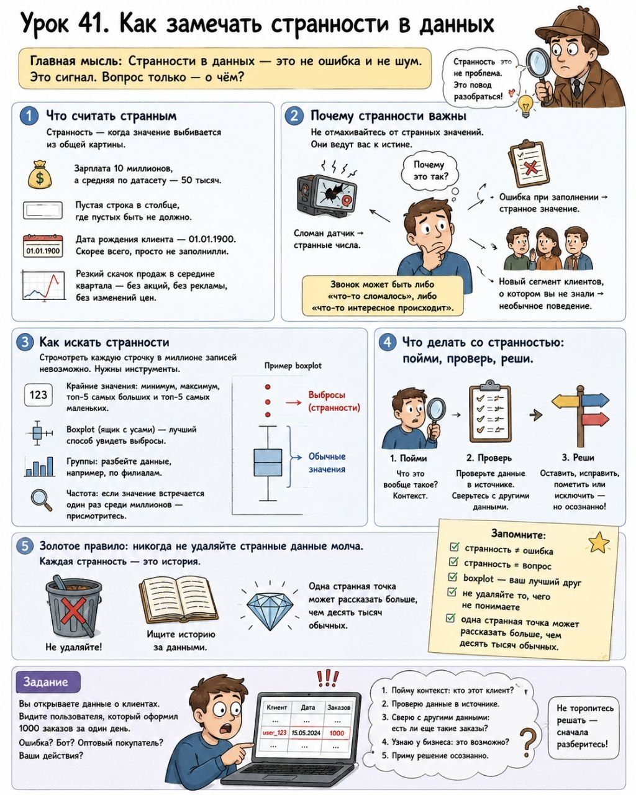

# Урок 41. Как замечать странности в данных

**Номер:** 41

Урок 41. Как замечать странности в данных

Главная мысль: Странности в данных — это не ошибка и не шум. Это сигнал. Вопрос только — о чём?

1. Что считать странным

Странность — когда значение выбивается из общей картины.

— Зарплата 10 миллионов, а средняя по датасету — 50 тысяч.
— Пустая строка в столбце, где пустых быть не должно.
— Дата рождения клиента — 01.01.1900. Скорее всего, просто не заполнили.
— Резкий скачок продаж в середине квартала — без акций, без рекламы, без изменений цен.

2. Почему странности важны

Не отмахивайтесь от странных значений. Они ведут вас к истине.

— Сломан датчик → странные числа.
— Ошибка при заполнении → странное значение.
— Новый сегмент клиентов, о котором вы не знали → необычное поведение.

Звонок может быть либо «что-то сломалось», либо «что-то интересное происходит».

3. Как искать странности

Посмотреть каждую строчку в миллионе записей невозможно. Нужны инструменты.

— Крайние значения: минимум, максимум, топ-5 самых больших и топ-5 самых маленьких.
— Boxplot (ящик с усами) — лучший способ увидеть выбросы.
— Группы: разбейте данные, например, по филиалам.
— Частота: если значение встречается один раз среди миллионов — присмотритесь.

4. Что делать со странностью: пойми, проверь, реши.

5. Золотое правило: никогда не удаляйте странные данные молча. Каждая странность — это история.

Запомните: странность ≠ ошибка; странность = вопрос; boxplot — ваш лучший друг; не удаляйте то, чего не понимаете; одна странная точка может рассказать больше, чем десять тысяч обычных.

Задание: Вы открываете данные о клиентах. Видите пользователя, который оформил 1000 заказов за один день. Ошибка? Бот? Оптовый покупатель? Ваши действия?
