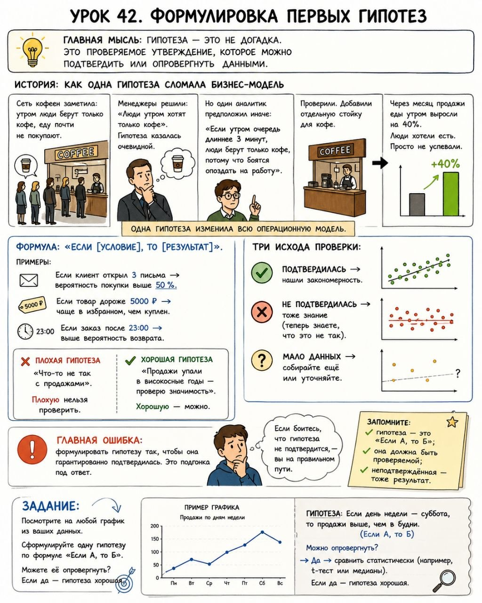

# Урок 42. Формулировка первых гипотез

**Номер:** 42

Урок 42. Формулировка первых гипотез

Главная мысль: Гипотеза — это не догадка. Это проверяемое утверждение, которое можно подтвердить или опровергнуть данными.

—

История: как одна гипотеза сломала бизнес-модель

Сеть кофеен заметила: утром люди берут только кофе, еду почти не покупают. Менеджеры решили: «Люди утром хотят только кофе». Гипотеза казалась очевидной.

Но один аналитик предположил иначе: «Если утром очередь длиннее 3 минут, люди берут только кофе, потому что боятся опоздать на работу».

Проверили. Добавили отдельную стойку для кофе. Через месяц продажи еды утром выросли на 40 %. Люди хотели есть. Просто не успевали.

Одна гипотеза изменила всю операционную модель.

—

Формула: «Если [условие], то [результат]».

Примеры:
— Если клиент открыл 3  письма → вероятность покупки выше 50 %.
— Если товар дороже 5000 ₽ → чаще в избранном, чем куплен.
— Если заказ после 23:00 → выше вероятность возврата.

Хорошая гипотеза vs плохая:
❌ «Что-то не так с продажами».
✅ «Продажи упали в високосные годы — проверю значимость».

Плохую нельзя проверить. Хорошую — можно.

Три исхода проверки:
— Подтвердилась → нашли закономерность.
— Не подтвердилась → тоже знание (теперь знаете, что это не так).
— Мало данных → собирайте ещё или уточняйте.

Главная ошибка: формулировать гипотезу так, чтобы она гарантированно подтвердилась. Это подгонка под ответ. Если боитесь, что гипотеза не подтвердится, — вы на правильном пути.

Запомните: гипотеза — это «Если А, то Б»; она должна быть проверяемой; неподтверждённая — тоже результат.

Задание: Посмотрите на любой график из ваших данных. Сформулируйте одну гипотезу по формуле «Если А, то Б». Можете её опровергнуть? Если да — гипотеза хорошая.
