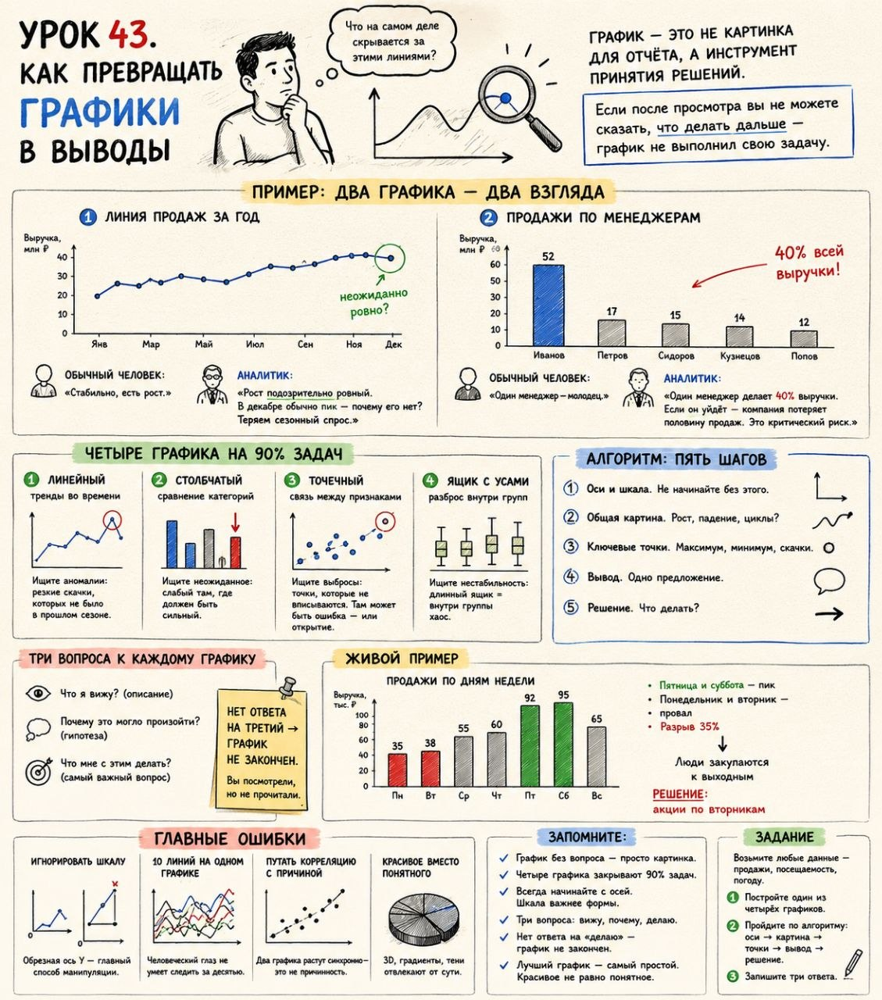

# Урок 43. Как превращать графики в выводы

**Номер:** 43

Урок 43. Как превращать графики в выводы

Главная мысль

Посмотрите на любой график. Что вы видите? Линию, столбики, точки. Теперь посмотрите ещё раз. Что на самом деле скрывается за этими линиями?

Большинство людей смотрят на график и видят просто данные. Они говорят: «Ну да, что-то растёт, что-то падает». И переходят к следующему делу.

Аналитик смотрит на тот же график и видит историю. Он видит, где скрыта проблема, где спрятана возможность и какое решение нужно принять. Он не просто смотрит — он читает.

График — это не картинка для отчёта. Это инструмент принятия решений. Если после просмотра вы не можете сказать, что делать дальше, — график не выполнил свою задачу.

—

Пример: два графика — два взгляда

График 1 — линия продаж за год. Ровно, небольшой рост к концу.
График 2 — продажи по менеджерам. Один продаёт втрое больше остальных.

Обычный человек: «Стабильно, есть рост. Один менеджер — молодец».

Аналитик:
На графике 1: «Рост подозрительно ровный. В декабре обычно пик — почему его нет? Теряем сезонный спрос».
На графике 2: «Один менеджер делает 40% выручки. Если он уйдёт — компания потеряет половину продаж. Это критический риск».

Одни данные. Разные выводы. Разница — в умении читать.

—

Четыре графика на 90% задач

📈 Линейный — тренды во времени. Ищите аномалии: резкие скачки, которых не было в прошлом сезоне.

📊 Столбчатый — сравнение категорий. Ищите неожиданное: слабый там, где должен быть сильный.

🔵 Точечный — связь между признаками. Ищите выбросы: точки, которые не вписываются. Там может быть ошибка — или открытие.

📦 Ящик с усами — разброс внутри групп. Ищите нестабильность: длинный ящик = внутри группы хаос.

—

Алгоритм: пять шагов
1. Оси и шкала. Не начинайте без этого.
2. Общая картина. Рост, падение, циклы?
3. Ключевые точки. Максимум, минимум, скачки.
4. Вывод. Одно предложение.
5. Решение. Что делать?

—

Три вопроса к каждому графику:
1. Что я вижу? (описание)
2. Почему это могло произойти? (гипотеза)
3. Что мне с этим делать? (самый важный вопрос)

Нет ответа на третий → график не закончен. Вы посмотрели, но не прочитали.

—

Главные ошибки:
— Игнорировать шкалу. Обрезная ось Y — главный способ манипуляции.
— 10 линий на одном графике. Человеческий глаз не умеет следить за десятью.
— Путать корреляцию с причиной. Два графика растут синхронно — это не причинность.
— Красивое вместо понятного. 3D, градиенты, тени отвлекают от сути.

—

Живой пример: столбчатая диаграмма продаж по дням недели → пятница и суббота — пик, понедельник и вторник — провал, разрыв 35% → люди закупаются к выходным → решение: акции по вторникам.

—

Запомните:
— График без вопроса — просто картинка.
— Четыре графика закрывают 90% задач.
— Всегда начинайте с осей. Шкала важнее формы.
— Три вопроса: вижу, почему, делаю.
— Нет ответа на «делаю» — график не закончен.
— Лучший график — самый простой. Красивое не равно понятное.

—

Задание: возьмите любые данные — продажи, посещаемость, погоду. Постройте один из четырёх графиков. Пройдите по алгоритму: оси → картина → точки → вывод → решение. Запишите три ответа.
