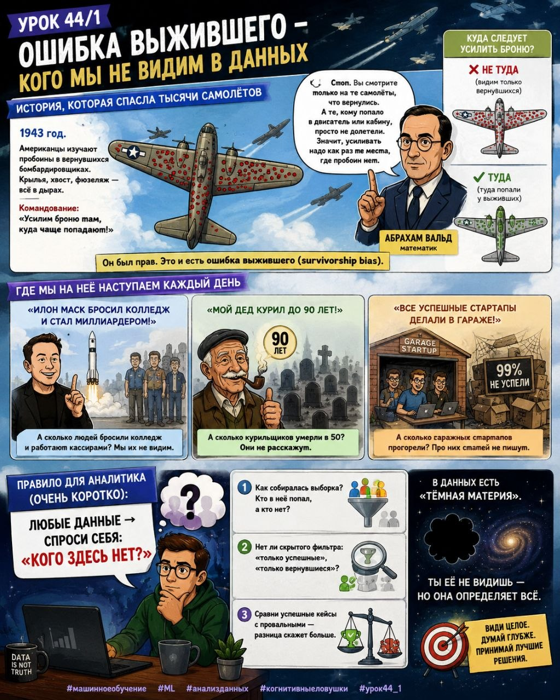

# Урок 44/1. Ошибка выжившего — кого мы не видим в данных

**Номер:** 44/1

📊 Урок 44/1. Ошибка выжившего — кого мы не видим в данных

История, которая спасла тысячи самолётов

1943 год. Американцы изучают пробоины в вернувшихся бомбардировщиках. Крылья, хвост, фюзеляж — всё в дырах. Командование: «Усилим броню там, куда чаще попадают!»

Математик Абрахам Вальд: «Стоп. Вы смотрите только на те самолёты, что *вернулись*. А те, кому попало в двигатель или кабину, просто не долетели. Значит, усиливать надо как раз те места, где пробоин нет».

Он был прав. Это и есть ошибка выжившего (survivorship bias).

Где мы на неё наступаем каждый день

— «Илон Маск бросил колледж и стал миллиардером!»
А сколько людей бросили колледж и работают кассирами? Мы их не видим.

— «Мой дед курил до 90 лет!»
А сколько курильщиков умерли в 50? Они не расскажут.

— «Все успешные стартапы делали в гараже!»
А сколько гаражных стартапов прогорели? Про них статей не пишут.

Правило для аналитика (очень коротко):

Любые данные → спроси себя: «Кого здесь нет?»

1. Как собиралась выборка? Кто в неё попал, а кто нет?
2. Нет ли скрытого фильтра: «только успешные», «только вернувшиеся»?
3. Сравни успешные кейсы с провальными — разница скажет больше.

В данных есть «тёмная материя». Ты её не видишь — но она определяет всё. 🎯

#машинноеобучение #ML #анализданных #когнитивныеловушки #урок44_1
