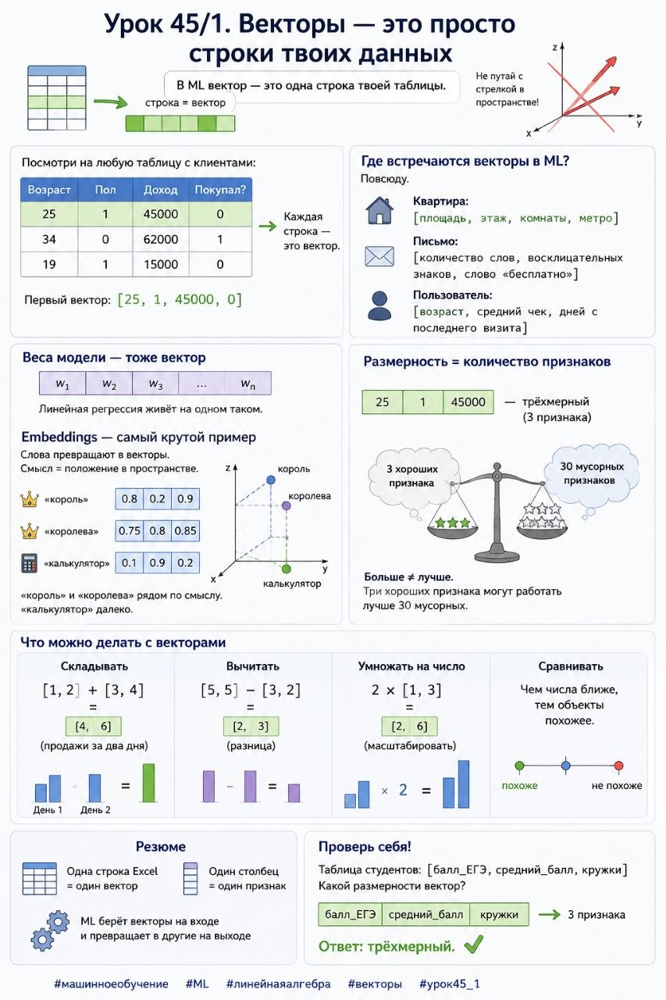

# Урок 45/1. Векторы — это просто строки твоих данных

**Номер:** 45/1

📊 Урок 45/1. Векторы — это просто строки твоих данных

Когда слышишь «вектор», представляешь стрелку в пространстве? Забудь. В ML вектор — это одна строка твоей таблицы.

Посмотри на любую таблицу с клиентами:

Возраст | Пол | Доход | Покупал?
25     | 1   | 45000 | 0
34     | 0   | 62000 | 1
19     | 1   | 15000 | 0

Каждая строка — это вектор. Первый: [25, 1, 45000, 0].

Где встречаются векторы в ML?

Повсюду.

Признаки объекта:
— Квартира: [площадь, этаж, комнаты, метро]
— Письмо: [количество слов, восклицательных знаков, слово «бесплатно»]
— Пользователь: [возраст, средний чек, дней с последнего визита]

Веса модели — тоже вектор: [w₁, w₂, w₃, ...]. Линейная регрессия живёт на одном таком.

Embeddings — самый крутой пример. Слова превращают в векторы. Смысл = положение в пространстве:
— «король» → [0.8, 0.2, 0.9]
— «королева» → [0.75, 0.8, 0.85] — рядом по смыслу
— «калькулятор» → [0.1, 0.9, 0.2] — далеко

Размерность = количество признаков.

[25, 1, 45000] — трёхмерный (3 признака). Больше ≠ лучше. Три хороших признака могут работать лучше 30 мусорных.

Что можно делать с векторами:
— Складывать: [1,2]   [3,4] = [4,6] (продажи за два дня)
— Вычитать: [5,5] − [3,2] = [2,3] (разница)
— Умножать на число: 2 × [1,3] = [2,6] (масштабировать)
— Сравнивать: чем числа ближе, тем объекты похожее

Резюме: одна строка Excel = один вектор. Один столбец = один признак. Всё, что делает ML, — берёт векторы на входе и превращает в другие на выходе.

Проверь себя:
Таблица студентов: [балл_ЕГЭ, средний_балл, кружки]. Какой размерности вектор? (Ответ: трёхмерный.) ✅

#машинноеобучение #ML #линейнаяалгебра #векторы #урок45_1
