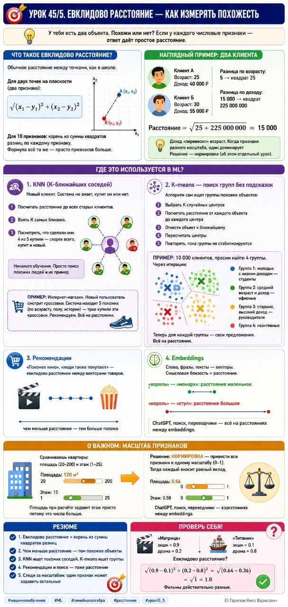

# Урок 45/5. Евклидово расстояние — как измерять похожесть

**Номер:** 45/5

📊 Урок 45/5. Евклидово расстояние — как измерять похожесть

У тебя есть два объекта. Похожи или нет? Если у каждого числовые признаки — ответ даёт простое расстояние.

Что такое евклидово расстояние?

Обычное расстояние между точками, как в школе.

Для двух точек на плоскости (два признака):
√((x₁ − y₁)² + (x₂ − y₂)²)

Для 10 признаков: корень из суммы квадратов разниц по каждому признаку. Формула всё та же — просто признаков больше.

Наглядный пример: два клиента

Клиент А: возраст 25, доход 40 000
Клиент Б: возраст 30, доход 55 000

Разница по возрасту: 5 → квадрат 25
Разница по доходу: 15 000 → квадрат 225 000 000

Расстояние = √(25 + 225 000 000) ≈ 15 000

Доход «перевесил» возраст. Когда признаки разного масштаба, один доминирует. Решение — нормировка (об этом отдельный урок).

Где это используется в ML?

1. KNN (K-ближайших соседей)

Новый клиент. Система не знает, купит он или нет.

Шаг 1: посчитать расстояние до всех старых клиентов.
Шаг 2: взять K самых близких.
Шаг 3: посмотреть, что сделали они. 4 из 5 купили — скорее всего, купит и новый.

Никакого обучения. Просто поиск похожих людей и их пример.

Пример: Интернет-магазин. Новый пользователь смотрит кроссовки. Система находит 5 похожих (по возрасту, полу, истории) — трое купили эти кроссовки. Рекомендуем. Всё на расстоянии.

2. K-means — поиск групп без подсказок

Алгоритм сам ищет группы похожих объектов:
1. Выбрать K случайных центров
2. Посчитать расстояние от каждого объекта до каждого центра
3. Отнести объект к ближайшему
4. Пересчитать центры
5. Повторять, пока группы не стабилизируются

Пример: 10 000 клиентов, просим найти 4 группы. Через итерации:
— Группа 1: молодые с низким доходом — студенты
— Группа 2: средний возраст и доход — офисные
— Группа 3: старшие, высокий доход — руководители
— Группа 4: неактивные

Теперь для каждой группы — свои предложения. Всё на расстоянии.

3. Рекомендации: «Похожее кино», «люди также покупают» — евклидово расстояние между векторами товаров.

4. Embeddings: Слова, фразы, тексты — векторы. Смысловая близость = расстояние.
«король» — «монарх»: расстояние маленькое.
«король» — «стул»: большое.
ChatGPT, поиск, переводчики — всё на расстояниях между embeddings.

О важном: масштаб признаков

Сравниваешь квартиры: площадь (20–200) и этаж (1–25). Площадь при расчёте задавит этаж просто потому что числа больше.

Решение: нормировка — привести все признаки к одному масштабу (0–1). Тогда каждый вносит равный вклад.

Резюме:
1. Евклидово расстояние = корень из суммы квадратов разниц
2. Чем меньше расстояние — тем похожее объекты
3. KNN ищет похожих соседей, K-means ищет группы
4. Рекомендации и поиск — тоже расстояние
5. Следи за масштабом: один признак может задавить остальные

Проверь себя:
«Матрица»: экшн = 0.9, драма = 0.2
«Титаник»: экшн = 0.1, драма = 0.8

Евклидово расстояние?
(Ответ: √((0.9−0.1)² + (0.2−0.8)²) = √(0.64 + 0.36) = √1 = 1.0. Фильмы действительно разные.) ✅

#машинноеобучение #ML #линейнаяалгебра #расстояние #урок45_5
