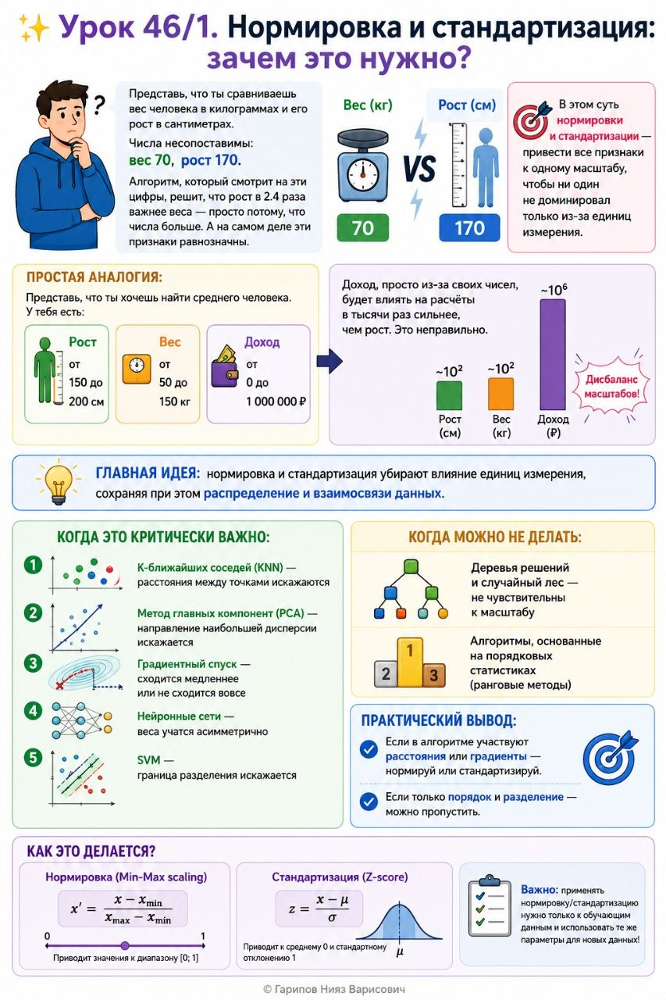

# Урок 46/1. Нормировка и стандартизация: зачем это нужно?

**Номер:** 46/1

## Урок 46/1. Нормировка и стандартизация: зачем это нужно?

### RU
Представь, что ты сравниваешь вес человека в килограммах и его рост в сантиметрах. Числа несопоставимы: вес 70, рост 170. Алгоритм, который смотрит на эти цифры, решит, что рост в 2.4 раза важнее веса — просто потому, что числа больше. А на самом деле эти признаки равнозначны.

В этом суть нормировки и стандартизации — привести все признаки к одному масштабу, чтобы ни один не доминировал только из-за единиц измерения.

Простая аналогия:
Представь, что ты хочешь найти среднего человека. У тебя есть:
- Рост: от 150 до 200 см
- Вес: от 50 до 150 кг
- Доход: от 0 до 1 000 000 ₽

Доход, просто из-за своих чисел, будет влиять на расчёты в тысячи раз сильнее, чем рост. Это неправильно.

Главная идея: нормировка и стандартизация убирают влияние единиц измерения, сохраняя при этом распределение и взаимосвязи данных.

Когда это критически важно:
1. K-ближайших соседей (KNN) — расстояния между точками искажаются
2. Метод главных компонент (PCA) — направление наибольшей дисперсии искажается
3. Градиентный спуск — сходится медленнее или не сходится вовсе
4. Нейронные сети — веса учатся асимметрично
5. SVM — граница разделения искажается

Когда можно не делать:
- Деревья решений и случайный лес — не чувствительны к масштабу
- Алгоритмы, основанные на порядковых статистиках (ранговые методы)

Практический вывод: Если в алгоритме участвуют расстояния или градиенты — нормируй или стандартизируй. Если только порядок и разделение — можно пропустить.

---
### EN (кратко)
Normalization and scaling remove the effect of different units of measurement. If feature A ranges 0-1 and feature B ranges 0-1,000,000, most ML algorithms will behave as if B is a million times more important. Scaling fixes this.

Key rule: Distance-based and gradient-based methods need scaling. Tree-based methods don't.
