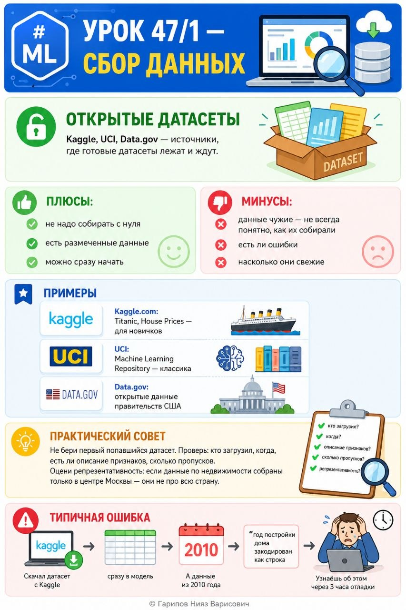

# ML. Урок 47/1 — Сбор данных

**Номер:** 47/1

# ML. Урок 47/1 — Сбор данных
## Открытые датасеты
Kaggle, UCI, Data.gov — источники, где готовые датасеты лежат и ждут.

Плюсы: не надо собирать с нуля, есть размеченные данные, можно сразу начать.

Минусы: данные чужие — не всегда понятно, как их собирали, есть ли ошибки, насколько они свежие.

### Примеры
- Kaggle.com: Titanic, House Prices — для новичков
- UCI: Machine Learning Repository — классика
- Data.gov: открытые данные правительств США

### Практический совет
Не бери первый попавшийся датасет. Проверь: кто загрузил, когда, есть ли описание признаков, сколько пропусков. Оцени репрезентативность: если данные по недвижимости собраны только в центре Москвы — они не про всю страну.

### Типичная ошибка
Скачал датасет с Kaggle → сразу в модель. А данные из 2010 года, и признак "год постройки дома" закодирован как строка. Узнаёшь об этом через 3 часа отладки.
