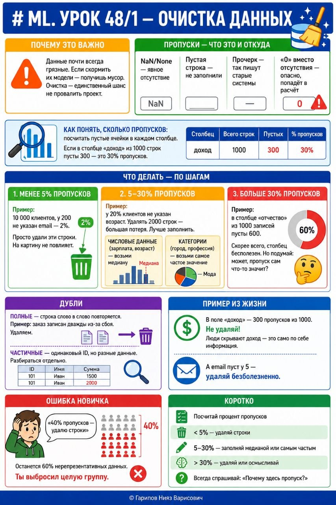

# ML. Урок 48/1 — Очистка данных

**Номер:** 48/1

# ML. Урок 48/1 — Очистка данных
## Почему это важно

Данные почти всегда грязные. Если скормить их модели — получишь мусор. Очистка — единственный шанс не провалить проект.

Пропуски — что это и откуда
• NaN/None — явное отсутствие
• Пустая строка — не заполнили
• Прочерк — так пишут старые системы
• «0» вместо отсутствия — опасно, попадёт в расчёт

Как понять, сколько пропусков: посчитать пустые ячейки в каждом столбце. Если в столбце «доход» из 1000 строк пусты 300 — это 30% пропусков.

Что делать — по шагам

Менее 5% пропусков
Пример: 10 000 клиентов, у 200 не указан email — 2%. Просто удали эти строки. На картину не повлияет.

5–30% пропусков
Пример: у 20% клиентов не указан возраст. Удалять 2000 строк — большая потеря. Лучше заполнить.
• Числовые данные (зарплата, возраст) — возьми медиану
• Категории (город, профессия) — возьми самое частое значение

Больше 30% пропусков
Пример: в столбце «отчество» из 1000 записей пусты 600. Скорее всего, столбец бесполезен. Но подумай: может, пропуск сам что-то значит?

Дубли
Полные — строка слово в слово повторяется. Пример: заказ записан дважды из-за сбоя. Удаляем.
Частичные — одинаковый ID, но разные данные. Разбираться отдельно.

Пример из жизни
В поле «доход» — 300 пропусков из 1000. Не удаляй! Люди скрывают доход — это само по себе информация. А email пуст у 5 — удаляй безболезненно.

Ошибка новичка
«40% пропусков — удалю строки». Останется 60% нерепрезентативных данных. Ты выбросил целую группу.

Коротко
• Посчитай процент пропусков
• < 5% — удаляй строки
• 5–30% — заполняй медианой или самым частым
• > 30% — удаляй или осмысливай
• Всегда спрашивай: «Почему здесь пропуск?»
