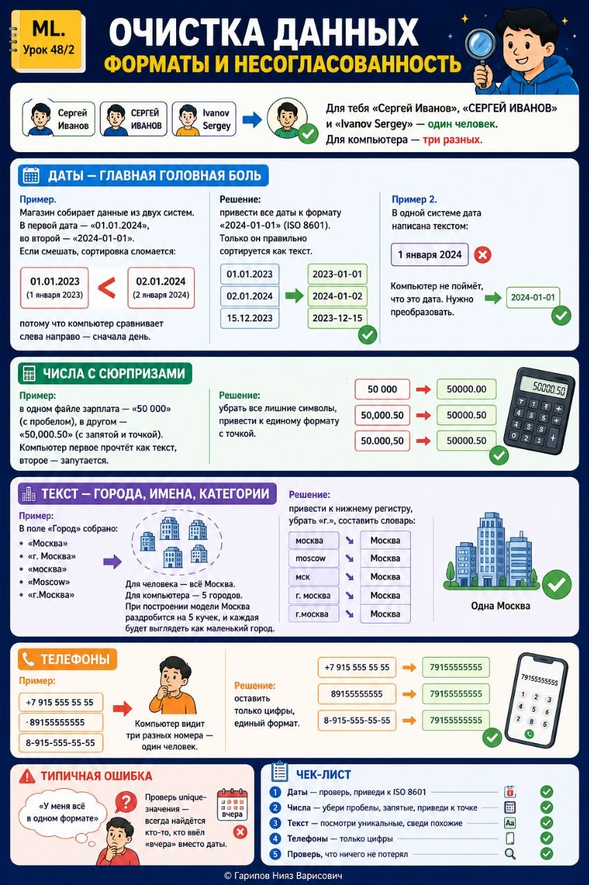

# ML. Урок 48/2 — Очистка данных

**Номер:** 48/2

# ML. Урок 48/2 — Очистка данных
## Форматы и несогласованность

Для тебя «Сергей Иванов», «СЕРГЕЙ ИВАНОВ» и «Ivanov Sergey» — один человек. Для компьютера — три разных.

Даты — главная головная боль

Пример. Магазин собирает данные из двух систем. В первой дата — «01.01.2024», во второй — «2024-01-01». Если смешать, сортировка сломается: «01.01.2023» (1 января 2023) встанет раньше «02.01.2024» (2 января 2024), потому что компьютер сравнивает слева направо — сначала день.

Решение: привести все даты к формату «2024-01-01» (ISO 8601). Только он правильно сортируется как текст.

Пример 2. В одной системе дата написана текстом: «1 января 2024». Компьютер не поймёт, что это дата. Нужно преобразовать.

Числа с сюрпризами

Пример: в одном файле зарплата — «50 000» (с пробелом), в другом — «50,000.50» (с запятой и точкой). Компьютер первое прочтёт как текст, второе — запутается.

Решение: убрать все лишние символы, привести к единому формату с точкой.

Текст — города, имена, категории

Пример. В поле «Город» собрано:
• «Москва»
• «г. Москва»
• «москва»
• «Moscow»
• «г.Москва»

Для человека — всё Москва. Для компьютера — 5 городов. При построении модели Москва раздробится на 5 кучек, и каждая будет выглядеть как маленький город.

Решение: привести к нижнему регистру, убрать «г.», составить словарь: «москва», «moscow», «мск» → «Москва».

Телефоны

Пример: «+7 900 000 00 00», «89150000000», «8-915-000-00-00». Компьютер видит три разных номера — один человек.

Решение: оставить только цифры, единый формат.

Типичная ошибка
«У меня всё в одном формате». Проверь unique-значения — всегда найдётся кто-то, кто ввёл «вчера» вместо даты.

Чек-лист
1. Даты — проверь, приведи к ISO 8601
2. Числа — убери пробелы, запятые, приведи к точке
3. Текст — посмотри уникальные, сведи похожие
4. Телефоны — только цифры
5. Проверь, что ничего не потерял
