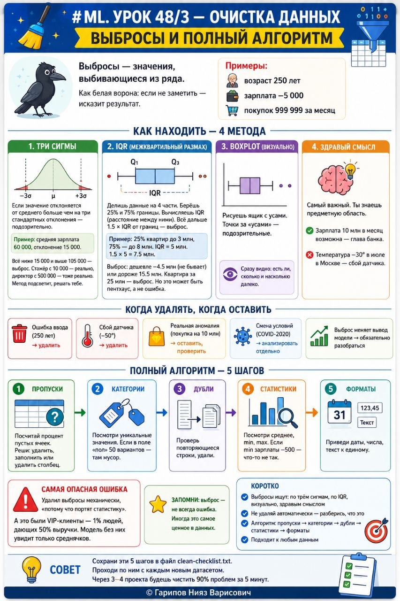

# ML. Урок 48/3 — Очистка данных

**Номер:** 48/3

# ML. Урок 48/3 — Очистка данных
## Выбросы и полный алгоритм

Выбросы — значения, выбивающиеся из ряда. Как белая ворона: если не заметить — исказит результат.

Примеры: возраст 250 лет, зарплата −5 000, покупок 999 999 за месяц.

Как находить — 4 метода

Метод 1. Три сигмы
Если значение отклоняется от среднего больше чем на три стандартных отклонения — подозрительно.
Пример: средняя зарплата 60 000, отклонение 15 000. Всё ниже 15 000 и выше 105 000 — выброс. Стажёр с 10 000 — реально, директор с 500 000 — тоже реально. Метод подсветит, решать тебе.

Метод 2. IQR (межквартильный размах)
Делишь данные на 4 части. Берёшь 25% и 75% границы. Вычисляешь IQR (расстояние между ними). Всё дальше 1.5 × IQR от границ — выброс.
Пример: 25% квартир до 3 млн, 75% — до 8 млн. IQR = 5 млн. 1.5 × 5 = 7.5 млн. Выброс: дешевле −4.5 млн (не бывает) или дороже 15.5 млн. Квартира за 25 млн — выброс. Но это может быть пентхаус, а не ошибка.

Метод 3. Boxplot (визуально)
Рисуешь ящик с усами. Точки за «усами» — подозрительные. Сразу видно: есть ли, сколько и насколько далеко.

Метод 4. Здравый смысл
Самый важный. Ты знаешь предметную область. Зарплата 10 млн в месяц возможна — глава банка. Температура −30° в июле в Москве — сбой датчика.

Когда удалять, когда оставить
• Ошибка ввода (250 лет) → удалить
• Сбой датчика (−50°) → удалить
• Реальная аномалия (покупка на 10 млн) → оставить, проверить
• Смена условий (COVID-2020) → анализировать отдельно
• Выброс меняет вывод модели → обязательно разобраться

Полный алгоритм — 5 шагов

Шаг 1. Пропуски. Посчитай процент пустых ячеек. Реши: удалить, заполнить или удалить столбец.

Шаг 2. Категории. Посмотри уникальные значения. Если в поле «пол» 50 вариантов — там мусор.

Шаг 3. Дубли. Проверь повторяющиеся строки, удали.

Шаг 4. Статистики. Посмотри среднее, min, max. Если min зарплаты −500 — что-то не так.

Шаг 5. Форматы. Приведи даты, числа, текст к единому.

Самая опасная ошибка
Удалил выбросы механически, «потому что портят статистику». А это были VIP-клиенты — 1% людей, дающих 50% выручки. Модель без них увидит только среднячков.

Запомни: выброс — не всегда ошибка. Иногда это самое ценное в данных.

Совет
Сохрани эти 5 шагов в файл clean-checklist.txt. Проходи по ним с каждым новым датасетом. Через 3–4 проекта будешь чистить 90% проблем за 5 минут.

Коротко
• Выбросы ищут: по трём сигмам, по IQR, визуально, здравым смыслом
• Не удаляй автоматически — разберись, что это
• Алгоритм: пропуски → категории → дубли → статистики → форматы
• Подходит к любым данным
