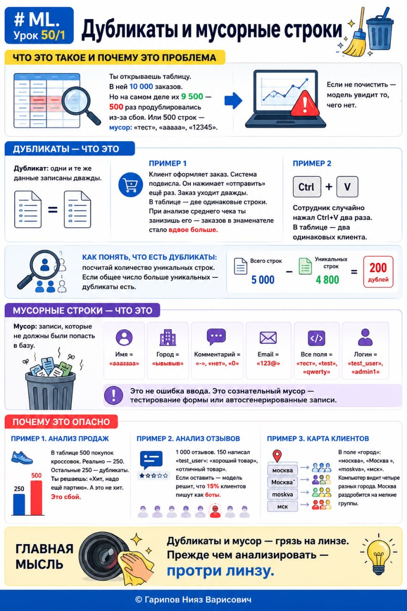

# ML. Урок 50/1 — Дубликаты и мусорные строки

**Номер:** 50/1

# ML. Урок 50/1 — Дубликаты и мусорные строки
## Что это такое и почему это проблема

Ты открываешь таблицу. В ней 10 000 заказов. Но на самом деле их 9 500 — 500 раз продублировались из-за сбоя. Или 500 строк — мусор: «тест», «ааааа», «12345».

Если не почистить — модель увидит то, чего нет.

Дубликаты — что это

Дубликат: одни и те же данные записаны дважды.

Пример. Клиент оформляет заказ. Система подвисла. Он нажимает «отправить» ещё раз. Заказ уходит дважды. В таблице — две одинаковые строки. При анализе среднего чека ты занизишь его — заказов в знаменателе стало вдвое больше.

Ещё пример. Сотрудник случайно нажал Ctrl+V два раза. В таблице — два одинаковых клиента.

Как понять, что есть дубликаты: посчитай количество уникальных строк. Если общее число больше уникальных — дубликаты есть. Пример: 5 000 строк, уникальных 4 800. 200 дублей.

Мусорные строки — что это

Мусор: записи, которые не должны были попасть в базу.
• Имя = «аааааа»
• Город = «ывывыв»
• Комментарий = «-», «нет», «0»
• Email = «123@»
• Все поля = «тест», «test», «qwerty»
• Логин = «test_user», «admin1»

Это не ошибка ввода. Это сознательный мусор — тестирование формы или автосгенерированные записи.

Почему это опасно

Пример 1. Анализ продаж. В таблице 500 покупок кроссовок. Реально — 250. Остальные 250 — дубликаты. Ты решаешь: «Хит, надо ещё партию». А это не хит. Это сбой.

Пример 2. Анализ отзывов. 1 000 отзывов. 150 написал «test_user»: «хороший товар», «отличный товар». Если оставить — модель решит, что 15% клиентов пишут как боты.

Пример 3. Карта клиентов. В поле «город»: «москва», «Москва », «moskva», «мск». Компьютер видит четыре разных города. Москва раздробится на мелкие группы.

Главная мысль

Дубликаты и мусор — грязь на линзе. Прежде чем анализировать — протри линзу.
