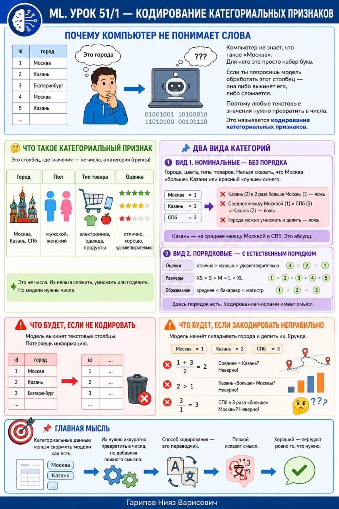

# ML. Урок 51/1 — Кодирование категориальных признаков

**Номер:** 51/1

📊 ML. Урок 51/1 — Кодирование категориальных признаков
## Почему компьютер не понимает слова

Представь, что у тебя есть таблица. В ней столбец «город» со значениями: Москва, Казань, Екатеринбург. Ты смотришь и понимаешь — это города. Компьютер — нет.

Компьютер не знает, что такое «Москва». Для него это просто набор букв. Если ты попросишь модель обработать этот столбец — она либо выкинет его, либо сломается.

Поэтому любые текстовые значения нужно превратить в числа. Это называется кодирование категориальных признаков.

🤔 Что такое категориальный признак

Это столбец, где значения — не числа, а категории (группы).

Примеры:
🔹 Город: Москва, Казань, СПб
🔹 Пол: мужской, женский
🔹 Тип товара: электроника, одежда, продукты
🔹 Оценка: отлично, хорошо, удовлетворительно

Это не числа. Их нельзя сложить, умножить или поделить. Но модели нужны числа.

🧩 Два вида категорий

Вид 1. Номинальные — без порядка.
Города, цвета, типы товаров. Нельзя сказать, что Москва «больше» Казани или красный «лучше» синего.

Если закодировать города числами (Москва=1, Казань=2, СПб=3), модель подумает:
• Казань (2) в 2 раза больше Москвы (1) — ложь
• Среднее между Москвой (1) и СПб (3) = Казань (2) — ложь
• Города можно умножать и делить — ложь

Казань — не среднее между Москвой и СПб. Это абсурд.

Вид 2. Порядковые — с естественным порядком.
Оценки: отлично > хорошо > удовлетворительно
Размеры: XS < S < M < L < XL
Уровни образования: среднее < бакалавр < магистр

Здесь порядок есть. Кодирование числами имеет смысл.

⚠️ Что будет, если не кодировать
Модель выкинет текстовые столбцы. Потеряешь информацию.

⚠️ Что будет, если закодировать неправильно
Модель начнёт складывать города и делить их. Ерунда.

📌 Главная мысль
Категориальные данные нельзя скормить модели как есть. Их нужно аккуратно превратить в числа, не добавляя ложного смысла. Способ кодирования — это переводчик. Плохой исказит смысл. Хороший — передаст ровно то, что нужно.
