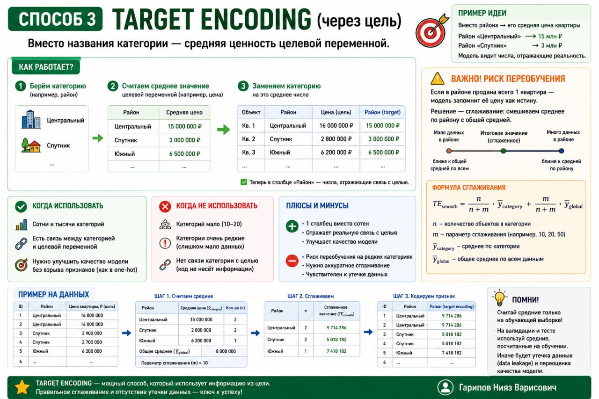

# ML. Урок 52/1 — Feature engineering

**Номер:** 52/1

📊 ML. Урок 52/1 — Feature engineering
## Что это и зачем нужно

Feature engineering — это создание новых признаков из тех, что уже есть.

У тебя есть столбец «дата покупки». Из него можно сделать: день недели, час, месяц, признак «выходной или будний». Модель увидит не просто дату, а сразу несколько полезных сигналов.

🎯 Зачем этим заниматься

Модель видит только то, что ты ей даёшь. Если не покажешь правильные признаки — она не догадается.

📌 Пример. Предсказываешь, купит ли клиент товар. Есть дата первого визита и дата покупки.

Если дать две даты — модель их проигнорирует (даты для модели — просто числа).

Если посчитать разницу и дать признак «сколько дней прошло с первого визита» — модель увидит:
• 1–3 дня → горячий клиент
• 30+ дней → холодный

Feature engineering превращает сырые данные в понятные сигналы.

🧩 Что можно создать

Из «дата»:
• День недели
• Час (утро, день, вечер, ночь)
• Выходной (да/нет)
• Месяц (сезонность)

Из «сумма покупки»:
• Логарифм (если разброс: 100 руб и 5 млн — модель сходит с ума)
• Флаг «дорогая покупка» (>10 000 руб)
• Квадрат суммы (если связь нелинейная)

🎯 Главная мысль

Хороший feature engineering часто важнее выбора модели. Одна и та же модель с правильно созданными признаками может выиграть у нейросети с сырыми данными.
