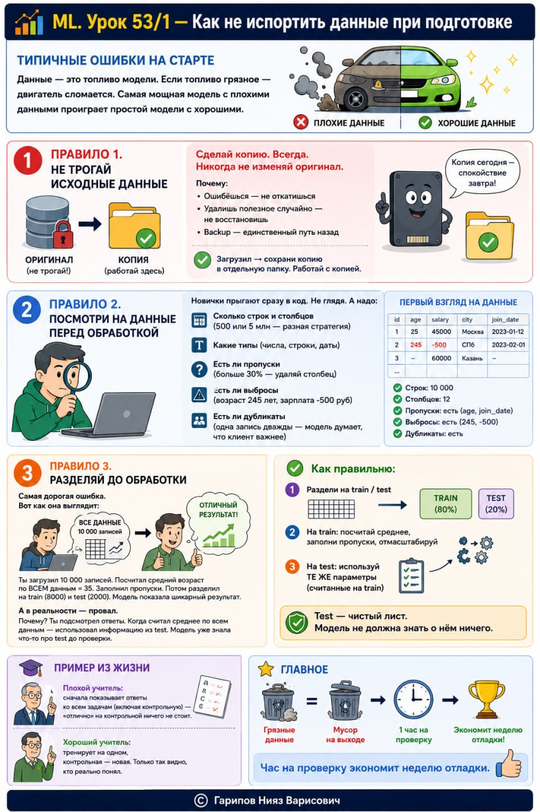

# ML. Урок 53/1 — Как не испортить данные при подготовке

**Номер:** 53/1

📊 ML. Урок 53/1 — Как не испортить данные при подготовке
## Типичные ошибки на старте

Данные — это топливо модели. Если топливо грязное — двигатель сломается. Самая мощная модель с плохими данными проиграет простой модели с хорошими.

🚫 Правило 1. Не трогай исходные данные

Сделай копию. Всегда. Никогда не изменяй оригинал.

Почему:
• Ошибёшься — не откатишься
• Удалишь полезное случайно — не восстановишь
• Backup — единственный путь назад

✅ Загрузил → сохрани копию в отдельную папку. Работай с копией.

👀 Правило 2. Посмотри на данные перед обработкой

Новички прыгают сразу в код. Не глядя. А надо:

• Сколько строк и столбцов (500 или 5 млн — разная стратегия)
• Какие типы (числа, строки, даты)
• Есть ли пропуски (больше 30% — удаляй столбец)
• Есть ли выбросы (возраст 245 лет, зарплата -500 руб)
• Есть ли дубликаты (одна запись дважды — модель думает, что клиент важнее)

⚠️ Правило 3. Разделяй ДО обработки

Самая дорогая ошибка. Вот как она выглядит:

Ты загрузил 10 000 записей. Посчитал средний возраст по ВСЕМ данным = 35. Заполнил пропуски. Потом разделил на train (8000) и test (2000). Модель показала шикарный результат.

А в реальности — провал.

Почему? Ты подсмотрел ответы. Когда считал среднее по всем данным — использовал информацию из test. Модель уже знала что-то про test до проверки.

✅ Как правильно:
1. Раздели на train / test
2. На train: посчитай среднее, заполни пропуски, отмасштабируй
3. На test: используй ТЕ ЖЕ параметры (считанные на train)

Test — чистый лист. Модель не должна знать о нём ничего.

🎓 Пример из жизни

Плохой учитель: сначала показывает ответы ко всем задачам (включая контрольную) — «отлично» на контрольной ничего не стоит.

Хороший учитель: тренирует на одном, контрольная — новая. Только так видно, кто реально понял.

📌 Главное

Грязные данные = мусор на выходе. Час на проверку экономит неделю отладки.
