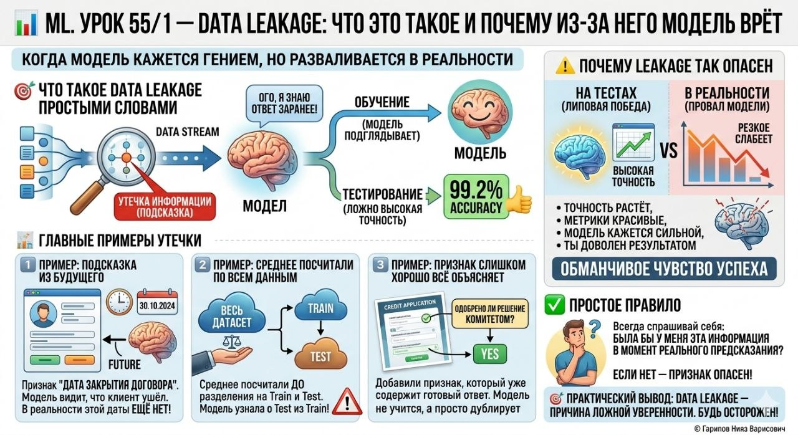

# ML. Урок 55/1 — Data leakage

**Номер:** 55/1

📊 ML. Урок 55/1 — Data leakage
## Что это такое и почему из-за него модель врёт

Есть ошибка, которая особенно коварна в машинном обучении. Она не ломает код. Не вызывает красных ошибок на экране. Наоборот — она делает всё слишком красивым.

Модель показывает высокую точность. Графики радуют глаз. Кажется, что ты почти гений.

А потом модель выходит в реальную жизнь — и разваливается.

Причина часто одна: data leakage, или утечка данных.

🎯 Что такое data leakage простыми словами

Это ситуация, когда в обучение модели случайно попадает информация, которой у неё в реальной жизни быть не должно.

То есть модель как будто подглядывает в ответы заранее.

Из-за этого она показывает слишком хороший результат на тесте. Но это нечестный результат.

📌 Главная идея

Если модель во время обучения увидела кусочек будущего или скрытую подсказку, она кажется умной только на бумаге.

На реальных данных эта магия исчезает.

1️⃣ Пример: подсказка из будущего

Ты строишь модель, которая должна предсказывать, уйдёт клиент или нет.

И в данные случайно попадает признак:
«Дата закрытия договора».

Если договор уже закрыт, модель почти без труда поймёт, что клиент ушёл.

Но в момент реального предсказания этой даты у тебя ещё нет.

2️⃣ Пример: среднее посчитали по всем данным

Есть пропуски в возрасте клиентов.

Ты берёшь весь датасет, считаешь средний возраст и только потом делишь на train и test.

Проблема в том, что среднее уже использовало test. Ты как будто дал модели кусочек ответов заранее.

3️⃣ Пример: признак слишком хорошо всё объясняет

Ты предсказываешь, выдадут человеку кредит или нет.

И добавляешь признак:
«одобрено ли решение кредитным комитетом».

Это уже почти готовый ответ, а не честный признак.

⚠️ Почему leakage так опасен

Потому что он не выглядит как ошибка.

Наоборот:
• точность растёт
• метрики красивые
• модель кажется сильной
• ты доволен результатом

Но это фальшивая победа.

Когда модель попадает на настоящие данные, где нет скрытых подсказок, она резко слабеет.

✅ Простое правило

Всегда спрашивай себя:

Была бы у меня эта информация в тот момент, когда я делаю реальное предсказание?

Если нет — признак опасен.

🎯 Практический вывод

Data leakage — одна из главных причин ложной уверенности в ML. Если не следить за утечкой данных, модель может выглядеть блестяще и при этом быть бесполезной.
