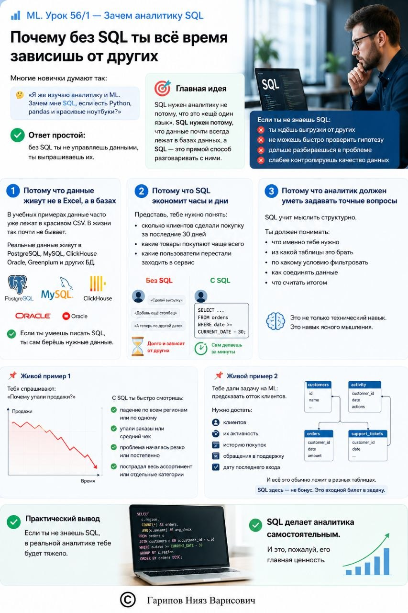

# ML. Урок 56/1 — Зачем аналитику SQL

**Номер:** 56/1

📊 ML. Урок 56/1 — Зачем аналитику SQL
## Почему без SQL ты всё время зависишь от других

Многие новички думают так:

«Я же изучаю аналитику и ML. Зачем мне SQL, если есть Python, pandas и красивые ноутбуки?»

Ответ простой: без SQL ты не управляешь данными, ты выпрашиваешь их.

И вот это ключевая проблема.

🎯 Главная идея

SQL нужен аналитику не потому, что это «ещё один язык». SQL нужен потому, что данные почти всегда лежат в базах данных, а SQL — это прямой способ разговаривать с ними.

Если ты не знаешь SQL:
• ты ждёшь выгрузки от других
• не можешь быстро проверить гипотезу
• дольше разбираешься в проблеме
• слабее контролируешь качество данных

1️⃣ Потому что данные живут не в Excel, а в базах

В учебных примерах данные часто уже лежат в красивом CSV. В жизни так почти не бывает.

Реальные данные живут в PostgreSQL, MySQL, ClickHouse, Oracle, Greenplum и других БД.

Если ты умеешь писать SQL, ты сам берёшь нужные данные.

2️⃣ Потому что SQL экономит часы и дни

Представь, тебе нужно понять:
• сколько клиентов сделали покупку за последние 30 дней
• какие товары покупают чаще всего
• какие пользователи перестали заходить в сервис

Без SQL ты идёшь к инженеру:
«Сделай выгрузку»
«Добавь ещё столбец»
«А теперь по другой дате»

С SQL ты сам делаешь это за минуты.

3️⃣ Потому что аналитик должен уметь задавать точные вопросы

SQL учит мыслить структурно.

Ты должен понимать:
• что именно тебе нужно
• из какой таблицы это брать
• по какому условию фильтровать
• как соединять данные
• что считать итогом

Это не только технический навык. Это навык ясного мышления.

📌 Живой пример 1

Тебя спрашивают:
«Почему упали продажи?»

С SQL ты быстро смотришь:
• падение по всем регионам или по одному
• упали заказы или средний чек
• проблема началась резко или постепенно
• пострадал весь ассортимент или отдельные категории

📌 Живой пример 2

Тебе дали задачу на ML: предсказать отток клиентов.

Нужно достать:
• клиентов
• их активность
• историю покупок
• обращения в поддержку
• дату последнего входа

И всё это обычно лежит в разных таблицах.

SQL здесь — не бонус. Это входной билет в задачу.

✅ Практический вывод

Если ты не знаешь SQL, в реальной аналитике тебе будет тяжело.

SQL делает аналитика самостоятельным. И это, пожалуй, его главная ценность.
