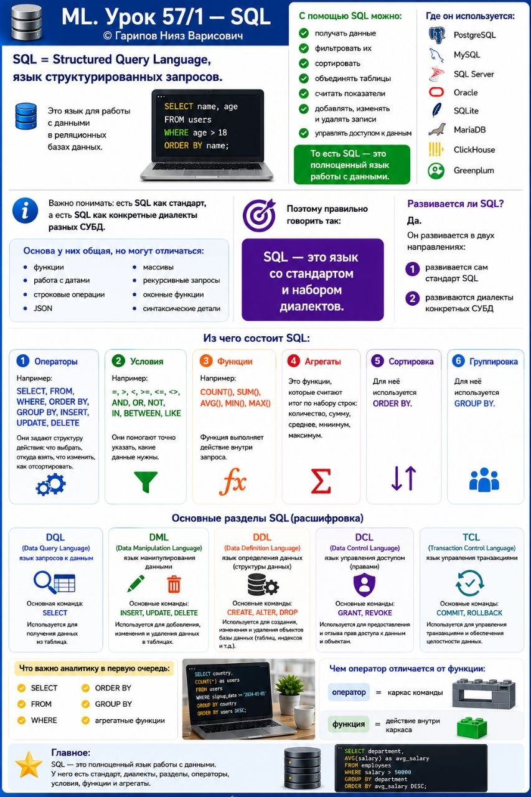

# ML. Урок 57/1 — SQL

**Номер:** 57/1

📊 ML. Урок 57/1 — SQL

SQL = Structured Query Language, язык структурированных запросов.

Это язык для работы с данными в реляционных базах данных.

С помощью SQL можно:
• получать данные
• фильтровать их
• сортировать
• объединять таблицы
• считать показатели
• добавлять, изменять и удалять записи
• управлять доступом к данным

То есть SQL — это полноценный язык работы с данными.

Где он используется:
• PostgreSQL
• MySQL
• SQL Server
• Oracle
• SQLite
• MariaDB
• ClickHouse
• Greenplum

Важно понимать: есть SQL как стандарт, а есть SQL как конкретные диалекты разных СУБД.

Основа у них общая, но могут отличаться:
• функции
• работа с датами
• строковые операции
• JSON
• массивы
• рекурсивные запросы
• оконные функции
• синтаксические детали

Поэтому правильно говорить так:
SQL — это язык со стандартом и набором диалектов.

Развивается ли SQL?
Да.

Он развивается в двух направлениях:
1. развивается сам стандарт SQL
2. развиваются диалекты конкретных СУБД

Из чего состоит SQL:

1️⃣ Операторы
Например:
SELECT, FROM, WHERE, ORDER BY, GROUP BY, INSERT, UPDATE, DELETE

Они задают структуру действия: что выбрать, откуда взять, что изменить, как отсортировать.

2️⃣ Условия
Например:
=, >, <, >=, <=, <>, AND, OR, NOT, IN, BETWEEN, LIKE

Они помогают точно указать, какие данные нужны.

3️⃣ Функции
Например:
COUNT(), SUM(), AVG(), MIN(), MAX()

Функция выполняет действие внутри запроса.

4️⃣ Агрегаты
Это функции, которые считают итог по набору строк:
количество, сумму, среднее, минимум, максимум.

5️⃣ Сортировка
Для неё используется ORDER BY.

6️⃣ Группировка
Для неё используется GROUP BY.

Основные разделы SQL:
• DQL — запросы к данным (SELECT)
• DML — изменение данных (INSERT, UPDATE, DELETE)
• DDL — структура данных (CREATE, ALTER, DROP)
• DCL — права доступа (GRANT, REVOKE)
• TCL — транзакции (COMMIT, ROLLBACK)

Что важно аналитику в первую очередь:
• SELECT
• FROM
• WHERE
• ORDER BY
• GROUP BY
• агрегатные функции

Чем оператор отличается от функции:
• оператор = каркас команды
• функция = действие внутри каркаса

Главное:
SQL — это полноценный язык работы с данными.
У него есть стандарт, диалекты, разделы, операторы, условия, функции и агрегаты.
